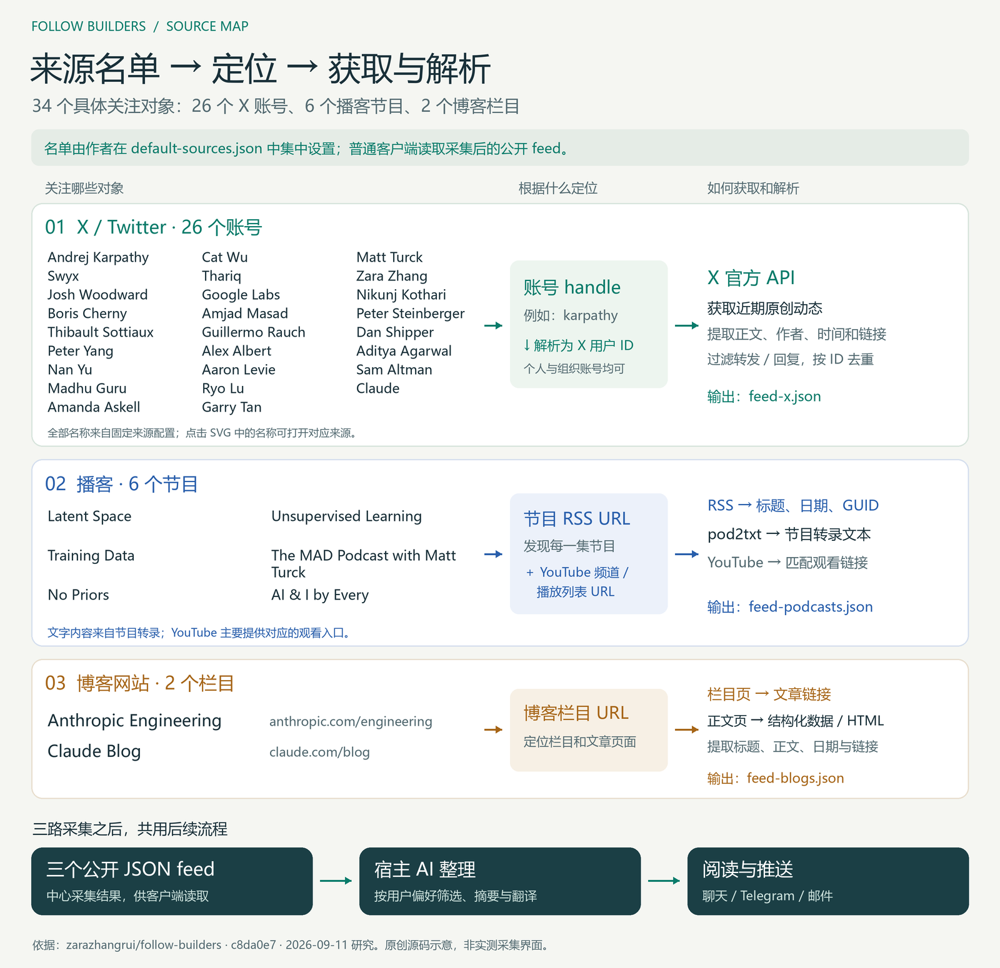

# GitHub 优秀项目研究集

记录值得深入研究的 GitHub 开源项目，整理核心思路、源码分析、实践过程与可复用的经验，并为适合的项目提供 Web 演示。

本页提供摘要与有序索引；详细研究、截图和运行说明保存在各子项目中。

## 项目索引

按三位编号升序排列，编号一经分配保持不变。

| 编号 | 研究项目 | 摘要 | 原始仓库 | 研究状态 | Web 演示 |
| :--- | :--- | :--- | :--- | :--- | :--- |
| 001 | [Jan](projects/001-jan/README.md) | 类 ChatGPT 的开源桌面 App：组织上下文、接入本地或云端模型并执行工具；附架构研究与 Web 页面 | [janhq/jan](https://github.com/janhq/jan) | 研究中 | — |
| 002 | [Follow Builders](projects/002-follow-builders/README.md) | 预设平台上的账号、节目、网站及对应抓取方式，采集解析后由 AI 整理为可阅读、可推送的简报 | [zarazhangrui/follow-builders](https://github.com/zarazhangrui/follow-builders) | 已总结 | — |
| 004 | [小智 ESP32](projects/004-xiaozhi-esp32/README.md) | 适配硬件的固件库：AI 产品硬件组成、固件能力、DIY 接线与自制产品全流程 | [78/xiaozhi-esp32](https://github.com/78/xiaozhi-esp32) | 已总结 | [在线阅读](https://yydshly.github.io/0912_codex_project/004-xiaozhi-esp32/) |

## 项目图览

### 001 · [Jan](projects/001-jan/README.md)

[理解汇总](projects/001-jan/notes/understanding.md) · [Web 页面本地查看](projects/001-jan/web/README.md)（尚未上线）

**Jan 是一个类 ChatGPT 的开源桌面 App。** 以“输入 → 上下文 → 模型 → 反馈”为核心，关联记忆检索、工具与子 Agent、下载升级和文件管理。另附六大能力域与十八个源码研究入口。原创概念架构图；已做源码静态梳理，尚未运行验证。


### 002 · [Follow Builders](projects/002-follow-builders/README.md)

**预设来源驱动的 AI 简报工具。** 提前设置平台上的具体账号、节目或网站栏目及对应抓取方式，经采集、解析、过滤去重后，交给宿主 AI 摘要和翻译，再展示或推送。[理解汇总](projects/002-follow-builders/notes/08-understanding.md) · [完整研究](projects/002-follow-builders/README.md)

下图列出 26 个 X 账号、6 个播客节目和 2 个博客栏目。播客经 RSS 与转录服务取文本，YouTube 用于匹配观看链接。原创源码示意，真实采集与推送尚未端到端验证。



### 004 · [小智 ESP32](projects/004-xiaozhi-esp32/README.md)

通过真实主板与原型照片，拆解硬件、固件和 AI 后端的分工，并记录采购、接线、焊接、自制 PCB 及产品化过程。原创硬件组成与固件能力引导图；已核对固定源码，硬件与后端未实测。[在线阅读](https://yydshly.github.io/0912_codex_project/004-xiaozhi-esp32/) · [Web 运行说明](projects/004-xiaozhi-esp32/web/README.md)（GitHub Pages 已部署）。


## 仓库结构

```text
.
├── README.md                 # 对外摘要、有序索引与项目图览
├── AGENTS.md                 # 后续协作时遵循的仓库约定
├── projects/                 # 研究项目：001-slug、002-slug……
├── templates/project/       # 新研究项目模板
│   ├── README.md             # 项目介绍、研究结论、复现与演示入口
│   ├── assets/               # 封面、截图、架构图及来源说明
│   ├── notes/                # 研究过程与专题笔记
│   └── web/                  # 可选 Web 演示及其独立运行说明
└── docs/
    ├── CONVENTIONS.md         # 编号、收录和图片维护约定
    └── DEPLOYMENT.md          # 多项目 Web 演示部署约定
```

## 开始研究

1. 查看索引，选择下一个未使用的编号，将[项目模板](templates/project/README.md)复制到 `projects/编号-英文短名/`。
2. 填写原始仓库、研究目标与版本信息，再逐步补充笔记、截图和实践代码。
3. 更新本页索引；有代表性图片后补充图览，有可访问的演示后填写链接。

详细规则见[维护约定](docs/CONVENTIONS.md)，Web 演示规划见[部署约定](docs/DEPLOYMENT.md)。

## 来源与许可

每个子项目记录原始仓库、作者和上游许可证。引用、复制或修改上游代码及图片时，应保留其要求的版权与许可说明。本仓库目前未为原创内容指定统一开源许可证。
