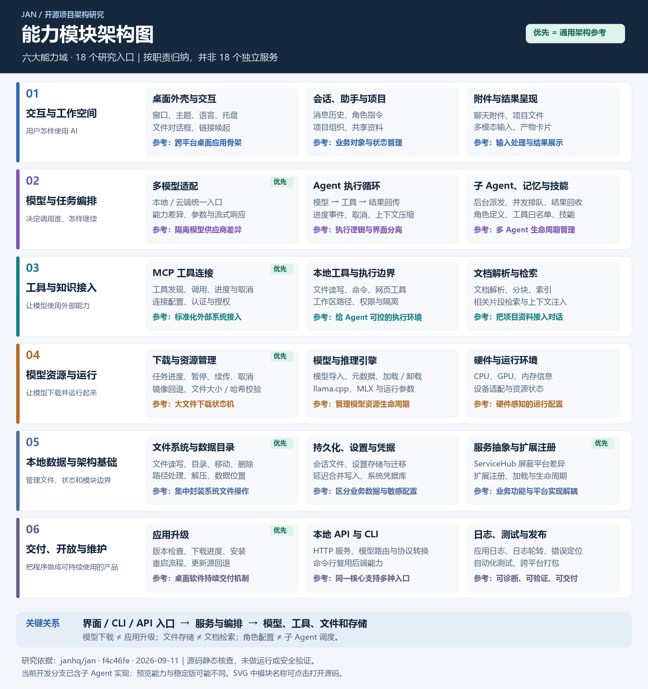
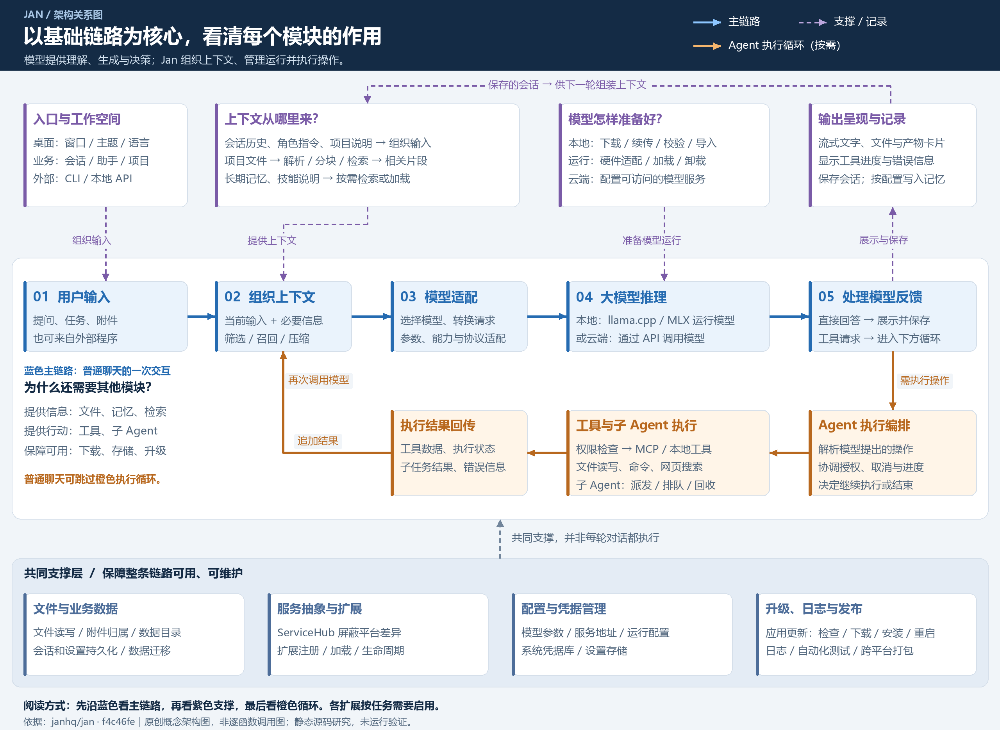
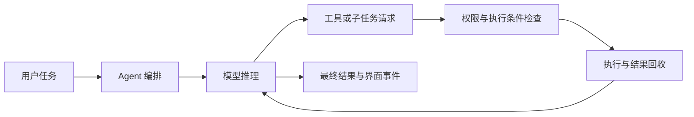

# Jan 能力模块架构与参考价值

研究日期：2026-09-11。固定提交：`f4c46fefc64f88adaca24d63541873f1e318a04b`。研究方式：目录核对、接口与关键实现静态阅读。未运行应用、模型或上游测试。

## 阅读方式

下面六大能力域与十八个模块是为研究归纳的职责视图，并不等于上游有十八个互不依赖的服务。一个能力通常横跨前端服务、TypeScript 扩展和 Rust 后端。表中“优先”表示对我们构建 AI 应用的通用参考价值，是研究判断，不是上游质量评级。

## 模块清单：有什么、能参考什么、去哪里找

| 能力域 | 模块 | 已看到的能力 | 对我们的参考价值 | 固定提交位置 | 建议顺序 |
| :--- | :--- | :--- | :--- | :--- | :--- |
| 交互与工作空间 | **桌面外壳与交互** | 窗口、主题、语言、托盘；文件对话框、链接唤起 | 跨平台桌面应用骨架 | [源码入口](https://github.com/janhq/jan/tree/f4c46fefc64f88adaca24d63541873f1e318a04b/web-app/src/services) | 按需求 |
| 交互与工作空间 | **会话、助手与项目** | 消息历史、角色指令；项目组织、共享资料 | 业务对象与状态管理 | [源码入口](https://github.com/janhq/jan/tree/f4c46fefc64f88adaca24d63541873f1e318a04b/src-tauri/src/core/threads) | 按需求 |
| 交互与工作空间 | **附件与结果呈现** | 聊天附件、项目文件；多模态输入、产物卡片 | 输入处理与结果展示 | [源码入口](https://github.com/janhq/jan/tree/f4c46fefc64f88adaca24d63541873f1e318a04b/web-app/src/services/uploads) | 按需求 |
| 模型与任务编排 | **多模型适配** | 本地 / 云端统一入口；能力差异、参数与流式响应 | 隔离模型供应商差异 | [源码入口](https://github.com/janhq/jan/blob/f4c46fefc64f88adaca24d63541873f1e318a04b/web-app/src/lib/model-factory.ts) | 优先 |
| 模型与任务编排 | **Agent 执行循环** | 模型 → 工具 → 结果回传；进度事件、取消、上下文压缩 | 执行逻辑与界面分离 | [源码入口](https://github.com/janhq/jan/blob/f4c46fefc64f88adaca24d63541873f1e318a04b/src-tauri/src/core/agent/loop.rs) | 按需求 |
| 模型与任务编排 | **子 Agent、记忆与技能** | 后台派发、并发排队、结果回收；角色定义、工具白名单、技能 | 多 Agent 生命周期管理 | [源码入口](https://github.com/janhq/jan/blob/f4c46fefc64f88adaca24d63541873f1e318a04b/src-tauri/src/core/agent/subagent.rs) | 按需求 |
| 工具与知识接入 | **MCP 工具连接** | 工具发现、调用、进度与取消；连接配置、认证与授权 | 标准化外部系统接入 | [源码入口](https://github.com/janhq/jan/tree/f4c46fefc64f88adaca24d63541873f1e318a04b/src-tauri/src/core/mcp) | 优先 |
| 工具与知识接入 | **本地工具与执行边界** | 文件读写、命令、网页工具；工作区路径、权限与隔离 | 给 Agent 可控的执行环境 | [源码入口](https://github.com/janhq/jan/tree/f4c46fefc64f88adaca24d63541873f1e318a04b/src-tauri/plugins/tauri-plugin-agent-tools/src) | 按需求 |
| 工具与知识接入 | **文档解析与检索** | 文档解析、分块、索引；相关片段检索与上下文注入 | 把项目资料接入对话 | [源码入口](https://github.com/janhq/jan/tree/f4c46fefc64f88adaca24d63541873f1e318a04b/extensions/rag-extension/src) | 按需求 |
| 模型资源与运行 | **下载与资源管理** | 任务进度、暂停、续传、取消；镜像回退、文件大小 / 哈希校验 | 大文件下载状态机 | [源码入口](https://github.com/janhq/jan/tree/f4c46fefc64f88adaca24d63541873f1e318a04b/src-tauri/src/core/downloads) | 优先 |
| 模型资源与运行 | **模型与推理引擎** | 模型导入、元数据、加载 / 卸载；llama.cpp、MLX 与运行参数 | 管理模型资源生命周期 | [源码入口](https://github.com/janhq/jan/tree/f4c46fefc64f88adaca24d63541873f1e318a04b/src-tauri/plugins/tauri-plugin-llamacpp) | 按需求 |
| 模型资源与运行 | **硬件与运行环境** | CPU、GPU、内存信息；设备适配与资源状态 | 硬件感知的运行配置 | [源码入口](https://github.com/janhq/jan/tree/f4c46fefc64f88adaca24d63541873f1e318a04b/src-tauri/plugins/tauri-plugin-hardware) | 按需求 |
| 本地数据与架构基础 | **文件系统与数据目录** | 文件读写、目录、移动、删除；路径处理、解压、数据位置 | 集中封装系统文件操作 | [源码入口](https://github.com/janhq/jan/tree/f4c46fefc64f88adaca24d63541873f1e318a04b/src-tauri/src/core/filesystem) | 优先 |
| 本地数据与架构基础 | **持久化、设置与凭据** | 会话文件、设置存储与迁移；延迟合并写入、系统凭据库 | 区分业务数据与敏感配置 | [源码入口](https://github.com/janhq/jan/blob/f4c46fefc64f88adaca24d63541873f1e318a04b/src-tauri/src/core/app/settings_store.rs) | 按需求 |
| 本地数据与架构基础 | **服务抽象与扩展注册** | ServiceHub 屏蔽平台差异；扩展注册、加载与生命周期 | 业务功能与平台实现解耦 | [源码入口](https://github.com/janhq/jan/blob/f4c46fefc64f88adaca24d63541873f1e318a04b/web-app/src/services/index.ts) | 优先 |
| 交付、开放与维护 | **应用升级** | 版本检查、下载进度、安装；重启流程、更新源回退 | 桌面软件持续交付机制 | [源码入口](https://github.com/janhq/jan/tree/f4c46fefc64f88adaca24d63541873f1e318a04b/web-app/src/services/updater) | 优先 |
| 交付、开放与维护 | **本地 API 与 CLI** | HTTP 服务、模型路由与协议转换；命令行复用后端能力 | 同一核心支持多种入口 | [源码入口](https://github.com/janhq/jan/tree/f4c46fefc64f88adaca24d63541873f1e318a04b/src-tauri/src/core/server) | 按需求 |
| 交付、开放与维护 | **日志、测试与发布** | 应用日志、日志轮转、错误定位；自动化测试、跨平台打包 | 可诊断、可验证、可交付 | [源码入口](https://github.com/janhq/jan/tree/f4c46fefc64f88adaca24d63541873f1e318a04b/.github/workflows) | 按需求 |

## 源码实际怎样组织

| 源码位置 | 主要职责 | 研究边界 |
| :--- | :--- | :--- |
| `web-app/src/` | 界面、状态、服务适配、模型请求与聊天编排 | 部分业务编排仍在前端，不应描述为全部迁到 Rust |
| `web-app/src/services/` | `ServiceHub` 与不同平台实现 | 发现移动平台分支不等于验证移动端产品完整可用 |
| `core/src/` | 共享类型和扩展相关抽象 | 这里的 core 主要是 TypeScript 公共层 |
| `extensions/` | 助手、会话、下载、推理、RAG、向量库等扩展 | 并非所有能力都以扩展形式实现 |
| `src-tauri/src/core/` | 应用、下载、文件、会话、Agent、MCP、API 和升级等后端模块 | 与 TypeScript `core/` 不是同一个层次 |
| `src-tauri/plugins/` | 原生工具、硬件、推理引擎、文档解析和检索等能力 | 有些核心支持无 Tauri 构建，有些依赖桌面环境 |
| `mlx-server/` | Swift / MLX 推理服务 | Apple Silicon 路径 |
| `src-tauri/jan-cli/` | 独立命令行入口 | 按功能复用后端，并非整个桌面 UI 的命令行映射 |
| `.github/workflows/`、`tests/`、`autoqa/` | 构建发布、测试和质量保障 | 本次只核对存在及部分配置，不声称测试通过 |

依据：[ServiceHub](https://github.com/janhq/jan/blob/f4c46fefc64f88adaca24d63541873f1e318a04b/web-app/src/services/index.ts)、[Rust 构建特性](https://github.com/janhq/jan/blob/f4c46fefc64f88adaca24d63541873f1e318a04b/src-tauri/Cargo.toml)、[Agent 模块入口](https://github.com/janhq/jan/blob/f4c46fefc64f88adaca24d63541873f1e318a04b/src-tauri/src/core/agent/mod.rs)、[固定目录树](https://github.com/janhq/jan/tree/f4c46fefc64f88adaca24d63541873f1e318a04b)。

## 重点一：下载与升级，应当拆成两个模块

### 下载与资源管理

前端下载扩展调用后端下载命令。后端管理任务标识、取消信号、暂停状态与进度事件；下载辅助实现处理并行文件、代理、镜像回退、HTTP 续传及文件校验。

- 暂停会保留部分下载文件及恢复所需信息；取消与暂停采用不同的清理语义。
- 下载后按提供的预期大小、哈希等信息校验。不能理解为每个任意链接都必然具备完整校验元数据。
- 参考价值在于大文件任务的状态转换、恢复、错误传播与进度同步，可用于模型包、离线资源包等场景。

证据：[下载扩展](https://github.com/janhq/jan/blob/f4c46fefc64f88adaca24d63541873f1e318a04b/extensions/download-extension/src/index.ts)、[下载命令](https://github.com/janhq/jan/blob/f4c46fefc64f88adaca24d63541873f1e318a04b/src-tauri/src/core/downloads/commands.rs)、[下载实现](https://github.com/janhq/jan/blob/f4c46fefc64f88adaca24d63541873f1e318a04b/src-tauri/src/core/downloads/helpers.rs)。

### 应用升级

前端提供检查更新、安装与重启、下载进度回调接口。Rust 更新检查读取更新地址、比较版本并支持更新源回退；安装路径使用 Tauri updater。下载模型文件和替换应用安装包是不同的业务流程。

参考价值：把“更新检查”“下载进度”“安装”“重启”和 UI 状态分开，处理不同平台的交付差异。本次未验证自动回滚，不把回滚能力列为已实现结论。

证据：[升级接口](https://github.com/janhq/jan/blob/f4c46fefc64f88adaca24d63541873f1e318a04b/web-app/src/services/updater/types.ts)、[Tauri 升级实现](https://github.com/janhq/jan/blob/f4c46fefc64f88adaca24d63541873f1e318a04b/web-app/src/services/updater/tauri.ts)、[更新检查](https://github.com/janhq/jan/blob/f4c46fefc64f88adaca24d63541873f1e318a04b/src-tauri/src/core/updater/commands.rs)。

## 重点二：文件管理至少包含三个层次

| 层次 | Jan 对应职责 | 设计启发 |
| :--- | :--- | :--- |
| 文件系统操作 | 读写、枚举、目录、移动、删除、路径、解压、文件选择框 | 把操作系统差异封装在统一入口，耗时解压从界面线程移开 |
| 应用业务数据 | 会话、消息、项目、助手配置、附件归属、数据目录与迁移 | 为业务对象分配清晰的存储位置和生命周期 |
| 文件内容理解 | 文档解析、分块、向量化、检索，将片段交给模型 | 独立处理解析失败、索引更新与检索质量 |

桌面会话实现使用 `thread.json` 和 `messages.jsonl`，消息修改有按会话的异步锁。`threads/db.rs` 的 SQLite 分支针对移动平台，不能因为看到了 SQLite 就断言全部桌面会话都存数据库。

设置存储会将非敏感状态存入数据目录下的 `settings.json`，合并短时间内的连续写入，用临时文件替换目标，并在退出时 flush。凭据通过专门路径进入系统凭据库。上述机制值得参考，但跨平台崩溃恢复和秘密存储后备路径仍需单独验证。

文档 RAG 与 Agent 记忆也不同：RAG 面向附件与项目文件；本次所读 Agent `memory.rs` 使用向量库插件中的 FTS5/BM25 存储与检索历史片段，不能将所有“记忆”笼统描述成向量相似度检索。

证据：[文件命令](https://github.com/janhq/jan/blob/f4c46fefc64f88adaca24d63541873f1e318a04b/src-tauri/src/core/filesystem/commands.rs)、[桌面与移动分支](https://github.com/janhq/jan/blob/f4c46fefc64f88adaca24d63541873f1e318a04b/src-tauri/src/core/threads/commands.rs)、[设置存储](https://github.com/janhq/jan/blob/f4c46fefc64f88adaca24d63541873f1e318a04b/src-tauri/src/core/app/settings_store.rs)、[数据目录与迁移](https://github.com/janhq/jan/blob/f4c46fefc64f88adaca24d63541873f1e318a04b/src-tauri/src/core/app/commands.rs)、[附件入口](https://github.com/janhq/jan/blob/f4c46fefc64f88adaca24d63541873f1e318a04b/web-app/src/services/uploads/types.ts)、[RAG](https://github.com/janhq/jan/blob/f4c46fefc64f88adaca24d63541873f1e318a04b/extensions/rag-extension/src/index.ts)、[Agent 记忆](https://github.com/janhq/jan/blob/f4c46fefc64f88adaca24d63541873f1e318a04b/src-tauri/src/core/agent/memory.rs)。

## 重点三：平台抽象、扩展和模型适配不是同一个机制

- `ServiceHub` 为窗口、文件对话框、消息、项目、模型等提供集中服务入口，选择相应的平台实现。
- `ExtensionManager` 处理扩展实例、引擎注册、加载、激活、卸载等生命周期。
- `model-factory.ts` 处理模型供应商差异、能力判定、参数兼容和请求构造。
- Rust 插件提供原生推理、硬件检测、工具与文件解析等系统能力。

对我们而言，先学接口边界、状态所有权和生命周期，再决定是否需要完整插件系统。不要为尚不存在的扩展需求照搬整个框架。

证据：[ServiceHub](https://github.com/janhq/jan/blob/f4c46fefc64f88adaca24d63541873f1e318a04b/web-app/src/services/index.ts)、[ExtensionManager](https://github.com/janhq/jan/blob/f4c46fefc64f88adaca24d63541873f1e318a04b/web-app/src/lib/extension.ts)、[模型工厂](https://github.com/janhq/jan/blob/f4c46fefc64f88adaca24d63541873f1e318a04b/web-app/src/lib/model-factory.ts)。

## 重点四：当前开发分支确实可以参考多 Agent 实现

本轮比前一次概览更深入地读取了 `agent/subagent.rs`，发现的不只是目录或角色名称，而是实际调度实现：

- 子 Agent 定义包括名称、说明、系统指令、工具白名单和可选模型。
- 支持用户、项目和插件来源，桌面场景另有持久存储路径；不能把所有来源的覆盖顺序简单等同。
- 后台启动返回 `run_id`，之后等待并收集结果；有并发上限，超过上限通过信号量排队。
- 定义解析与权限交集在派发时检查；子 Agent 不能继续派发下一层子 Agent。
- 父任务结束或取消时，有后台子任务的取消与清理机制，避免留下孤立运行。
- 结果可写入工作区临时结果位置，并通过事件通知父任务。

因此，研究定位应补充为“AI 桌面工程 + 初步多 Agent 调度参考”。不过本次没有验证并发模型占用、长任务可靠性、隔离效果或最终成功率，不能据此评价它已是成熟多 Agent 平台。

还有一个需要以实现而非注释判断的细节：`session.rs` 描述预算跟踪，而当前 `loop.rs` 在预算超过阈值时记录提示并继续运行，不能将其列为强制成本上限。这是后续复用时必须重新设计或明确的行为。

证据：[子 Agent 派发与回收](https://github.com/janhq/jan/blob/f4c46fefc64f88adaca24d63541873f1e318a04b/src-tauri/src/core/agent/subagent.rs)、[主循环与实际预算行为](https://github.com/janhq/jan/blob/f4c46fefc64f88adaca24d63541873f1e318a04b/src-tauri/src/core/agent/loop.rs)、[技能存储](https://github.com/janhq/jan/blob/f4c46fefc64f88adaca24d63541873f1e318a04b/src-tauri/src/core/agent/skills.rs)、[Cowork 预览文档](https://www.jan.ai/docs/desktop/cowork)。

## 基础链路与扩展模块总关系

先看用户输入、上下文组织、模型适配、模型推理和反馈处理。文件检索、历史、记忆和技能为上下文提供材料；下载、校验、硬件与模型加载保障推理可运行。模型返回工具请求时，Jan 进入执行循环，将工具或子任务结果再次加入上下文。文件存储、服务抽象、配置、升级与日志则提供共同支撑。

图中会话记录回到下一轮上下文，不表示每条消息都会写入长期记忆；记忆与技能按对应模式和配置使用。本地与云端模型是替代路径，也不代表外部 API 调用必经所有桌面 UI 功能。所有关系按职责概括，具体执行路径因聊天、Cowork、CLI 和 API 模式而异。

[可编辑关系图](../assets/core-flow-architecture.svg)。源码依据见本页模块清单及重点分析。

## 三条关键链路

以下为阅读源码后归纳的概念链路，不代表每种模式都经过完全相同的函数。

## 建议研究顺序

| 阶段 | 重点 | 建议产出 |
| :--- | :--- | :--- |
| 现在：建立自己的应用骨架 | ServiceHub、模型适配、文件与设置、下载和升级 | 一张接口边界图、几个关键状态机、存储目录约定 |
| 接入资料与外部服务时 | 附件、RAG、MCP、工具执行权限 | 一条文件问答链路和一条工具执行链路 |
| 开始多 Agent 时 | 主循环、子任务调度、并发控制、取消、记忆、技能 | 可运行的父子任务原型与失败用例 |
| 准备交付时 | API/CLI、日志、打包发布与更新 | 可安装、可诊断、可升级的应用 |

参考重点是职责边界和故障处理，不意味着这些模块可以不改动地直接复制到我们的项目。模型和引擎适配、桌面框架、许可证及平台依赖都需要按目标重新评估。

## 验证记录与未验证事项

已完成：固定提交；核对目录；阅读下载、升级、文件、存储、服务抽象、模型工厂、Agent 和子 Agent 关键实现；生成并检查本地 PNG / SVG 与文档链接。

未完成：构建和启动上游、实际下载与升级、模型推理测试、MCP 联调、文件检索准确率、子任务并发与取消测试、权限和沙箱安全验证。图中“能力存在”表示源码证据，不是运行验收结论。

根 LICENSE 为 Apache-2.0，而部分包清单许可字段不同。实际摘取代码时核对组件自身许可及依赖许可，不仅凭根 README 判断。此处未复制上游代码。

[返回项目说明](../README.md)
