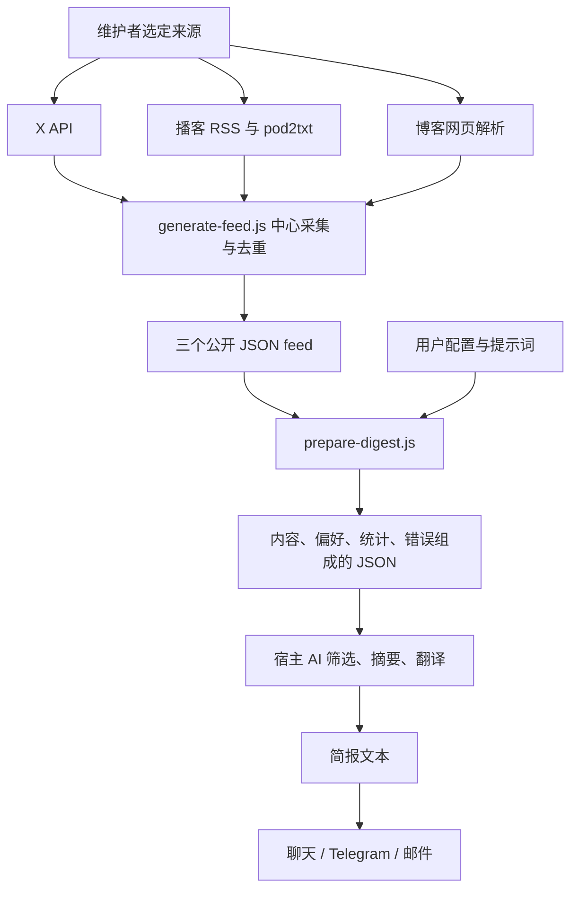

# 能力与数据流：输入什么，如何处理，输出什么

研究日期：2026-09-11；研究提交：`c8da0e7ece27d6a0007b53f54f546bf0ff1086d4`。

## 1. 能力边界

Follow Builders 是面向已有 AI 助手的内容整理工作流。中心端收集指定公开来源，消费端取得内容和偏好，宿主大模型生成简报，发送脚本负责交付。

主要资产是策展名单、来源适配逻辑和摘要规则。该提交只有三个业务脚本，没有独立 Web 应用、内置模型服务、向量数据库或完整多用户后台，也没有根据阅读行为持续学习的推荐系统。依据：[上游文件树][tree]、[Skill 工作流][skill]、[脚本依赖][package]。

## 2. 四类输入

| 输入层 | 实际字段 / 文件 | 谁提供 | 用途 |
| :--- | :--- | :--- | :--- |
| 来源名单 | `x_accounts[].name/handle`；`podcasts[].name/rssUrl/url`；`blogs[].indexUrl` 等 | 上游维护者 | 定义采集范围；客户端不自动发现新来源 |
| 原始内容 | 动态正文与链接；节目 GUID、标题、日期、转录；博客正文、作者、链接 | 外部来源与采集器 | 提供摘要依据 |
| 用户偏好 | `language`、`frequency`、`delivery`、时间、时区等 | 用户 / 宿主 Agent | 决定语言和渠道；时间配置需由调度器真正执行 |
| 编辑规则 | 五份 Markdown prompt，允许本地覆盖 | 作者 / 用户 | 决定筛选标准、摘要结构、篇幅与翻译风格 |

采集端还需要 `X_BEARER_TOKEN` 和 `POD2TXT_API_KEY`。普通读者使用作者的公开 feed 时不需要这两项；Telegram 和邮件独立发送仍需各自的凭证。模型推理依赖宿主平台，其成本不包含在公共 feed 中。[来源配置][sources]、[采集脚本][generator]、[发送脚本][deliver]

## 3. 处理链

### 采集：代码处理可确定的任务

`generate-feed.js` 读取来源配置，抓取内容，进行时间过滤、数量限制和中心去重。三个 feed 是当前采集批次，写入时覆盖上一批。`state-feed.json` 保存采集端最近见过的条目，不代表用户已读或收到。

去重状态会清除超过 7 天的记录，不是永久不重复保证。播客回看窗口为 14 天，较旧节目在状态过期后可能重新成为候选；转录失败的节目也被记为已见，后续周期内可能不再重试。详见[来源与采集](02-sources.md)。[采集脚本][generator]

### 准备：合成模型输入

`prepare-digest.js` 并行请求三个 feed，读取用户配置，并按“用户 prompt → 远程 prompt → 本地 prompt”的顺序加载规则。没有自定义规则时，共请求 3 个 feed 和 5 份 prompt。

结果包括 `config`、`podcasts`、`x`、`blogs`、`stats`、`prompts`、可选 `errors`。这是模型输入，不是完成的简报。它没有按频率切换数据窗口，也没有历史归档读取、用户级去重、token 预算或长转录分块逻辑。[准备脚本][prepare]

### 编辑：宿主模型承担语义工作

| 对象 | 上游规则 | 实际边界 |
| :--- | :--- | :--- |
| X 动态 | 保留实质观点、产品发布和经验；每位作者 2–4 句 | 有限原帖不保证包含完整线程和引用上下文 |
| 播客 | 约 200–400 words，先写主要收获，交代人物背景，突出经验 | 长文本直接交给宿主，受上下文容量影响 |
| 博客 | 约 100–300 words，突出发布、数字与影响 | Skill 执行步骤未完整补齐博客流程 |
| 翻译 | 简体中文；保留专名、常用英文技术词和 URL；双语逐段交错 | 没有独立翻译质量评分 |
| 总装 | X、博客、播客顺序；每条附来源；不编造 | 有链接不代表来源已核验或摘要必然准确 |

篇幅是英文 prompt 的 word 要求，不能直接宣称为中文固定字数。规则来源：[动态][tweet-prompt]、[播客][podcast-prompt]、[博客][blog-prompt]、[翻译][translate]、[总装][intro]。

### 分发：发送完成的文字

`deliver.js` 接受文件、命令行文本或标准输入，支持 `stdout`、Telegram、Resend 邮件。Telegram 约每 4000 字符拆段，优先换行，Markdown 解析失败时尝试纯文本。更多渠道依赖宿主消息系统。[发送脚本][deliver]

## 4. 三类输出

| 输出 | 用途 | 本次验证 |
| :--- | :--- | :--- |
| 原始 feed | 多客户端共享的数据层 | 已读取固定提交，X 为 14 位作者 / 28 条动态；播客、博客均为空 |
| prepare JSON | 给模型提供输入 | 已在虚拟 POSIX 环境执行原始准备脚本 |
| 最终简报 | 用户阅读、点击原文、进一步研究 | 上游端到端未运行；本研究提供明确标注的整理样例 |

本研究[展示样例](../examples/research-digest.md)只说明信息可以怎样呈现，不证明上游生成质量或采集实时性。

## 5. 如何判断有效

应分别测量：来源是否抓到、正文是否完整、摘要是否忠于原文、是否值得阅读、是否成功发送、是否重复。仓库没有完整评估数据集或准确率基准，因此不能给出“摘要准确率”“每天节省多少分钟”等量化结论。

对我们而言，它减少发现研究线索的操作步骤；真正的项目能力仍需通过源码和复现实验验证。

[返回项目说明](../README.md)

[tree]: https://github.com/zarazhangrui/follow-builders/tree/c8da0e7ece27d6a0007b53f54f546bf0ff1086d4
[skill]: https://github.com/zarazhangrui/follow-builders/blob/c8da0e7ece27d6a0007b53f54f546bf0ff1086d4/SKILL.md
[package]: https://github.com/zarazhangrui/follow-builders/blob/c8da0e7ece27d6a0007b53f54f546bf0ff1086d4/scripts/package.json
[sources]: https://github.com/zarazhangrui/follow-builders/blob/c8da0e7ece27d6a0007b53f54f546bf0ff1086d4/config/default-sources.json
[generator]: https://github.com/zarazhangrui/follow-builders/blob/c8da0e7ece27d6a0007b53f54f546bf0ff1086d4/scripts/generate-feed.js
[prepare]: https://github.com/zarazhangrui/follow-builders/blob/c8da0e7ece27d6a0007b53f54f546bf0ff1086d4/scripts/prepare-digest.js
[deliver]: https://github.com/zarazhangrui/follow-builders/blob/c8da0e7ece27d6a0007b53f54f546bf0ff1086d4/scripts/deliver.js
[tweet-prompt]: https://github.com/zarazhangrui/follow-builders/blob/c8da0e7ece27d6a0007b53f54f546bf0ff1086d4/prompts/summarize-tweets.md
[podcast-prompt]: https://github.com/zarazhangrui/follow-builders/blob/c8da0e7ece27d6a0007b53f54f546bf0ff1086d4/prompts/summarize-podcast.md
[blog-prompt]: https://github.com/zarazhangrui/follow-builders/blob/c8da0e7ece27d6a0007b53f54f546bf0ff1086d4/prompts/summarize-blogs.md
[translate]: https://github.com/zarazhangrui/follow-builders/blob/c8da0e7ece27d6a0007b53f54f546bf0ff1086d4/prompts/translate.md
[intro]: https://github.com/zarazhangrui/follow-builders/blob/c8da0e7ece27d6a0007b53f54f546bf0ff1086d4/prompts/digest-intro.md
