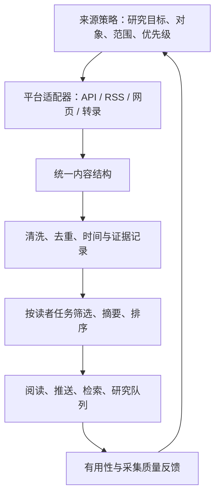

# 来源定制与价值：平台、关注对象和通用采集层

补充日期：2026-09-11。Follow Builders 依据 `c8da0e7ece27d6a0007b53f54f546bf0ff1086d4`；last30days-skill 依据本仓库研究的 `ca9d415e66073b17702f385d6886934097aec0e7`。来源策略是本研究建议，未实现为产品功能。

## 1. 来源到底是平台还是账号

“来源”这个词容易混用，设计系统时应至少分成以下层级：

| 层级 | 例子 | 决定什么 |
| :--- | :--- | :--- |
| 平台 / 内容载体 | X、YouTube、博客网站 | 需要哪种采集适配器 |
| 发布者 / 关注对象 | karpathy 账号、Latent Space 节目、Anthropic Engineering 栏目 | 长期关注谁的什么内容 |
| 订阅入口与范围 | handle、RSS URL、栏目 URL、仓库 Releases | 实际去哪里读，收集哪些条目 |
| 内容条目 | 一条推文、一集节目、一篇文章 | 去重、摘要、引用和评价的基本单位 |
| 中间数据服务 | 作者的 GitHub JSON feed、pod2txt | 内容如何传到客户端；不等同于原始发布者 |

RSS 是订阅格式 / 协议，不是一个独立内容平台。pod2txt 是转录服务，不是节目的原始发布者。GitHub 在这里承载作者的聚合 feed，不代表 Follow Builders 当前在采集 GitHub 项目动态。

**因此，34 表示配置中的具体账号、节目、栏目总数，不是平台数。**

## 2. 当前配置了哪些对象，怎样获取

| 类别 | 实际对象与数量 | 配置字段 | 获取过程 |
| :--- | :--- | :--- | :--- |
| X 账号 | 26 个个人 / 组织账号，例如 Karpathy、Swyx、Boris Cherny、Google Labs、Claude | `x_accounts[].name`、`handle` | 中心用 X API 将 handle 解析为用户 ID，再读取近期原创动态 |
| 播客节目 | 6 个：Latent Space、Training Data、No Priors、Unsupervised Learning、The MAD Podcast with Matt Turck、AI & I by Every | `podcasts[].name`、`rssUrl`、`url` | RSS 找新节目，pod2txt 取转录；YouTube 用于匹配观看入口 |
| 官方博客栏目 | 2 个：Anthropic Engineering、Claude Blog | `blogs[].name`、`indexUrl` 等 | 从栏目页发现文章，再用对应站点的逻辑提取正文 |

26 个 X 账号完整名单为：Andrej Karpathy、Swyx、Josh Woodward、Boris Cherny、Thibault Sottiaux、Peter Yang、Nan Yu、Madhu Guru、Amanda Askell、Cat Wu、Thariq、Google Labs、Amjad Masad、Guillermo Rauch、Alex Albert、Aaron Levie、Ryo Lu、Garry Tan、Matt Turck、Zara Zhang、Nikunj Kothari、Peter Steinberger、Dan Shipper、Aditya Agarwal、Sam Altman、Claude。

以上名称来自配置，不代表我们核验了每个人当前的任职或质量。[完整账号、RSS 与栏目链接](02-sources.md) · [上游固定来源配置](https://github.com/zarazhangrui/follow-builders/blob/c8da0e7ece27d6a0007b53f54f546bf0ff1086d4/config/default-sources.json)

配置只声明对象；中心采集脚本负责获取。普通用户消费作者已经整理好的三个 JSON feed，不会根据本地名单重新抓取原始平台。现有“个人定制”主要改变语言和摘要规则，尚不是每个人都能自由设置关注对象的订阅系统。

## 3. 与其他收集能力的差别

当前本仓库可直接对照的是 [last30days-skill 固定版本](https://github.com/mvanhorn/last30days-skill/tree/ca9d415e66073b17702f385d6886934097aec0e7)。以下“通用采集器”和“RSS 阅读器”是功能类型比较，不把未查到的历史研究项目当作已核验事实。

| 维度 | Follow Builders | last30days-skill | 通用采集器 / RSS 阅读器这一类 |
| :--- | :--- | :--- | :--- |
| 起点 | 先给出一份发布者名单 | 研究主题、对象、比较问题，或热点发现任务 | 提供 URL、订阅地址、规则或采集任务 |
| 核心问题 | 这些人和栏目最近说了什么？ | 围绕这个问题，近期有哪些证据？ | 给定入口，怎样稳定获取和整理内容？ |
| 来源选择 | 作者中心策展，以固定对象为主 | 根据任务规划查询与来源；也有关注列表和发现模式 | 一般由用户或上层任务决定，具体产品能力不同 |
| 内容深度 | 动态、播客转录、博客正文；上下文补全较有限 | 多来源检索，部分渠道有评论和字幕补充 | 取决于适配器，有的只获取列表，有的能深入正文 |
| 个性化重点 | 对同一批内容改变摘要与语言 | 改变研究问题、范围、来源和处理深度 | 改变采集目标、规则、阅读管理等 |
| 主要价值 | 一份策展名单和简报编辑规则，使用门槛低 | 查询规划、跨源取证、排序聚类等处理能力 | 可复用的采集、清洗、保存与阅读基础设施 |
| 主要风险 | 名单偏向、固定范围漏掉新对象、中心服务依赖 | 搜索漏召回、同名误匹配、平台覆盖和权限限制 | 抓到了内容，也未必知道是否值得研究 |

last30days-skill 也有发现模式和关注列表，不能将两者简化成完全互斥的“订阅 / 搜索”分类；区别是主要工作路径。比较依据：[上游运行契约](https://github.com/mvanhorn/last30days-skill/blob/ca9d415e66073b17702f385d6886934097aec0e7/skills/last30days/SKILL.md)、[任务与发现概念](https://github.com/mvanhorn/last30days-skill/blob/ca9d415e66073b17702f385d6886934097aec0e7/CONCEPTS.md)、[来源与跟踪配置](https://github.com/mvanhorn/last30days-skill/blob/ca9d415e66073b17702f385d6886934097aec0e7/CONFIGURATION.md)。两项目都尚未在本仓库完成真实多源端到端运行。

## 4. 确定来源之后，哪些能力可以通用

“获取 → 清洗 → 展示”是正确的基础抽象。为持续使用，通常还要补上内容规范化、去重存储、筛选摘要和可靠交付。

可通用程度不同：

- **获取的接口可以统一，内部实现仍依平台变化。** RSS、X API、博客正文和音频转录不可能靠同一种抓取规则完成。
- **清洗可共享基础层，仍需保留内容特征。** 网页导航清理、线程合并、转录分段和重复字幕处理是不同任务。
- **存储、时间记录、去重和展示组件可大量复用。** 前提是各适配器输出统一且可追溯的结构。
- **价值筛选必须知道读者在研究什么。** 同一篇市场访谈对商业研究可能重要，对复现一个开源工具未必有帮助。

Follow Builders 的获取和展示实现本身不足以构成很强的差异。若我们已有通用采集层，更值得复用的是名单背后的选择原则和编辑规则；补充缺少的适配器，不必重复搭建整条基础链路。

## 5. 来源应该怎样定制

现有上游：中心维护者可以改 X / 播客名单；新增博客通常还要加解析逻辑；自建中心后客户端必须切换 feed 地址。详细改动见[配置指南](03-configuration.md)。

我们拟议的来源配置应从“一个账号名”扩展为“一个有研究目的的订阅目标”：

| 字段 | 示例含义（设计示意） | 为什么需要 |
| :--- | :--- | :--- |
| 平台与稳定 ID | GitHub 某仓库、X 某账号、某 RSS | 正确定位对象，避免名称变化或同名混淆 |
| 内容范围 | Releases、技术文章、原创帖、特定节目集 | 关注有用栏目，减少整账号的噪声 |
| 研究主题 | 本地模型、Agent 工具调用、信息采集 | 让筛选与我们的目标对应 |
| 纳入理由 | 一手发布、提供实现细节、补充失败案例 | 避免“因为有名所以关注” |
| 获取方式 | 对应适配器、入口、更新频率 | 让采集可执行、可维护 |
| 筛选条件 | 保留仓库链接、排除营销转发等 | 让同一个来源为不同任务服务 |
| 状态 | 候选、试订、保留、降频、停用 | 允许随着内容变化更新名单 |
| 证据与评估 | 代表内容、最近成功采集、实际采用情况 | 根据样本决定是否值得继续 |

这些是设计字段，不能直接写进上游用户 `config.json` 就认为已经生效。

对象订阅与主题发现可以配合：从已知高价值来源持续获取，用周期性的主题检索发现名单外的新对象；将反复提供独立线索的对象纳入试订。这样既有稳定输入，也能减少固定名单造成的遗漏。

## 6. 哪些来源对我们有价值

应按任务分配来源，而不是给人或平台做永久排名。针对本仓库的开源项目能力研究，建议：

| 研究任务 | 优先来源 | 帮助回答什么 | 需要防止的误解 |
| :--- | :--- | :--- | :--- |
| 确认功能与版本 | 原始仓库代码、Releases、变更日志、官方文档 | 哪个版本实现了什么？ | README 声称不等于代码已接通 |
| 理解设计原因 | 维护者技术文章、设计讨论、相关 PR | 为什么这样做？什么取舍？ | 作者意图与当前实现可能有差距 |
| 发现实际限制 | Issues、Discussions、可复现使用报告 | 哪些条件下会失败？ | 单个问题不代表所有用户都受影响 |
| 发现新项目 | 精选构建者、开发者社区、主题检索 | 有什么值得进入研究队列？ | 热度不等于研究价值 |
| 理解方向与背景 | 相关技术播客、研究者访谈 | 方向为什么重要？有哪些假设？ | 观点与预测不能当作已验证能力 |

Follow Builders 的 34 项是作者策展的**候选名单**。本次只核对了配置和一个 feed 快照，没有逐一评估这些来源的长期质量。不能把“已收录”改写为“已证明对我们有价值”。两个博客都来自同一组织生态，具有一手性，也带有覆盖偏向。

可以采用小规模人工试评，例如每个候选检查最近 10–20 条可获取内容，再观察一段更新周期；这些数值是建议的起步样本，不是统计质量保证。记录：与目标有关多少、包含一手材料多少、提供可查证链接多少、重复已有来源多少、实际进入研究队列多少、获取是否稳定。根据这些记录保留或降频。

本研究下一步的重点应是建立“来源 → 采用理由 → 代表内容 → 对应研究项目”的关系，而不是继续罗列更多抓取工具。

[返回项目说明](../README.md) · [完整来源目录](02-sources.md) · [价值与建设路线](05-value-roadmap.md)
