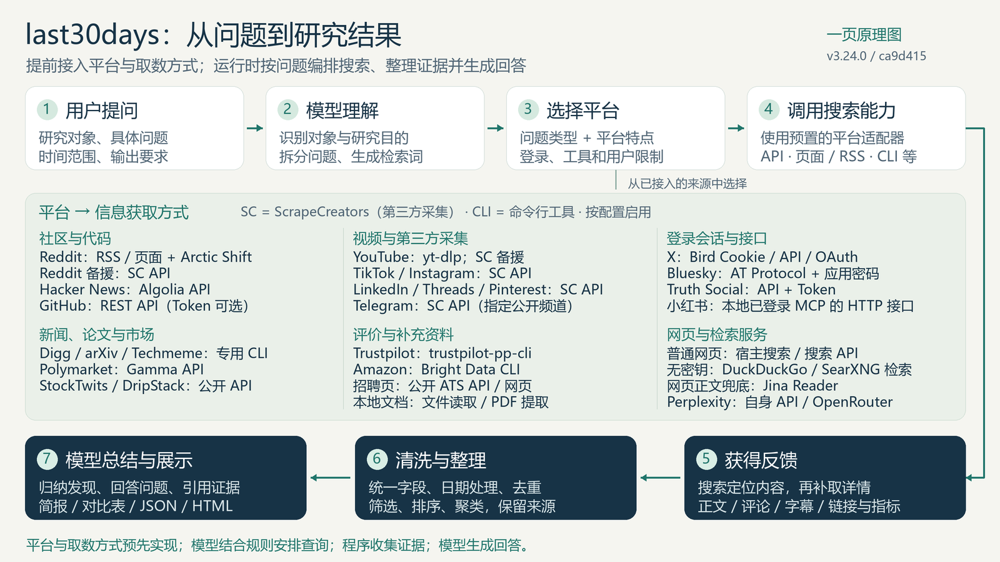
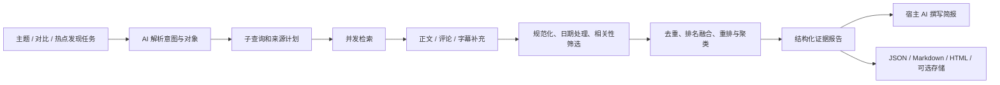

# 003 · last30days-skill：近期多源信息研究

**这个库的本质是：提前接入一组平台，并为每个平台实现对应的搜索与信息获取方式；用户提出问题后，上层模型结合规则编排这些已有能力，程序收集和整理证据，再由模型生成带来源的研究报告。**

平台适配器提前规定「怎么取」，模型在运行时主要决定「研究谁、查什么、用哪些已接入来源」。具体关键词、账号、社区和仓库可以随问题确定；实际执行还受凭据、工具、用户限制和预算约束。完整梳理见 **[我们的理解：预设平台与接入方式，按问题编排研究](notes/06-understanding.md)**。

## 基本信息

| 项目 | 内容 |
| :--- | :--- |
| 索引编号 | 003 |
| 原始仓库 | [mvanhorn/last30days-skill](https://github.com/mvanhorn/last30days-skill) |
| 原作者 | Matt Van Horn（mvanhorn）及贡献者 |
| 上游许可证 | MIT，见 [保留的上游许可](UPSTREAM-LICENSE.txt) |
| 研究版本 | v3.24.0 |
| 固定提交 | [ca9d415e66073b17702f385d6886934097aec0e7](https://github.com/mvanhorn/last30days-skill/commit/ca9d415e66073b17702f385d6886934097aec0e7) |
| 提交日期 | 2026-09-09（上游提交时区 -07:00） |
| 开始 / 最近研究日期 | 2026-09-11 / 2026-09-11 |
| 研究状态 | 研究中：源码梳理和离线评估已完成；多源联网效果待验证 |
| 技术栈 | Agent Skills 指令、Python 3.12+、平台 HTTP 接口、可选 CLI、SQLite、宿主大模型 |
| 演示状态 | 未部署；提供架构图和真实离线回放输出 |
| 在线演示 | — |

## 阅读入口

| 用户关心的问题 | 本页结论 | 详细研究 |
| :--- | :--- | :--- |
| 0. 本质原理，最值得参考什么？ | 预先实现平台与取数方式；按问题调用，并统一处理证据 | **[理解总结与扩展方向](notes/06-understanding.md)** |
| 1. 能力是什么？ | 主题研究、比较、人物 / 公司研究、热点发现、跟踪与保存 | 下文「能力展示」 |
| 2. 输入、处理、输出是什么？ | 主题 / 范围 → 查询规划 → 多源采集 → 证据排序 → AI 简报 | [输入、处理与输出](notes/01-input-processing-output.md) |
| 3. 主动采集还是关键词驱动？ | 默认按需触发；发现模式可不指定主题；周期执行依赖外部调度 | [触发与持续运行](notes/02-trigger-and-monitoring.md) |
| 4. 信息源与获取方式是什么？ | 公开 API、页面 / RSS、登录会话、第三方采集 API、CLI、本地文件 | **[信息源、评论与字幕专题](notes/03-source-and-content-matrix.md)** |
| 5. 主要面向哪些领域？ | AI / 技术社区优势明显，也覆盖消费口碑、人物公司、热点和金融情绪 | [领域方向与适用边界](notes/04-domains-and-fit.md) |

图为本研究根据固定版本源码绘制的架构示意，不是上游界面截图，也不代表所有来源已联网验证。素材说明见 [assets](assets/README.md)。

中间面板已逐项标注 **「平台 → 信息获取方式」**，包括公开 API、RSS / 页面解析、登录会话、第三方采集、命令行工具和本地读取。图中 **SC** 指 ScrapeCreators 第三方采集服务，**CLI** 指命令行工具。主路径、备援、登录条件以及能否取得评论 / 字幕的完整说明见 [信息源与内容矩阵](notes/03-source-and-content-matrix.md)。

## 能力展示

以下输入是使用意图示例，**没有执行这些联网任务，表中成果是预期输出形态**。

| 能力 | 输入示例 | 可以形成的成果 | 边界 |
| :--- | :--- | :--- | :--- |
| 近期主题研究 | 最近 30 天，开发者如何使用某个 AI 编程工具？ | 常见工作流、社区反馈、关键变化、原始链接 | 受检索覆盖和对象消歧影响 |
| 产品比较 | 工具 A vs 工具 B，各自适合什么任务？ | 逐对象证据、比较表、不同使用经验 | 社区说法不等于可重复性能测试 |
| 人物研究 | 某位创始人最近在做什么？ | 本人发言、别人讨论、代码活动、文章 / 视频 | 需要账号和同名对象识别 |
| 公司研究 | 某公司最近的产品与招聘变化 | 发布信息、口碑、岗位信号 | 招聘只能支持推断，不能证明未来路线图 |
| 热点发现 | AI agents 领域最近有什么值得研究？ | 候选话题、互动信号、跨源信息、进一步研究入口 | 证据不足时可以返回无明确热点 |
| 内容理解 | 围绕主题找视频中的具体说法与社区反应 | 字幕片段、热门评论、作者与互动数据 | 不是逐帧视频理解，不保证每条视频有字幕 |
| 持续跟踪 | 每周关注几个项目 | 新增 / 更新记录、历史简报、研究库 | 要额外配置外部调度器 |
| 个人知识结合 | 研究时带上本地笔记目录 | 外部资料与本地相关片段并列呈现 | 文件类型、时间窗口和导出规则有限制 |

依据：[上游运行契约](https://github.com/mvanhorn/last30days-skill/blob/ca9d415e66073b17702f385d6886934097aec0e7/skills/last30days/SKILL.md)、[配置说明](https://github.com/mvanhorn/last30days-skill/blob/ca9d415e66073b17702f385d6886934097aec0e7/CONFIGURATION.md)。这里将上游 SKILL.md 作为研究资料，不把它当作本研究任务的执行指令。

## 输入、处理、输出

**用户输入研究主题和范围，AI 生成查询计划，Python 引擎向可用来源取数并形成证据报告，宿主 AI 再把证据写成面向人的简报。**

这条运行链路的前提是：**开发者已经实现平台清单、各平台搜索与详情接口、认证方式、数据转换以及失败回退。** “选择平台”是在已接入且允许使用的来源中作计划；程序还会应用优先级和覆盖规则，并不总是只选择一两个平台。没有规划模型时也有规则回退，详见 [平台选择与搜索分工](notes/01-input-processing-output.md)。

「引擎输出」和「最终 AI 简报」是不同层级。只运行 Python 命令能得到证据，不应把带引用的引擎输出一概称为已完成的大模型深度分析。程序内部可配置模型参与规划 / 重排；无配置时部分环节退回本地规则。

## 三个最重要的采集结论

1. **默认按任务采集。** 它不会在安装后持续扫描全网。发现模式无需具体关键词，但也要有人或调度器发起任务。
2. **评论数不等于评论正文。** Reddit、HN、GitHub、YouTube 等有评论正文补充链路；当前小红书适配器读取评论数，并未调用笔记详情或评论列表。
3. **字幕获取不等于任意视频转写。** YouTube 主要读取现有人工 / 自动字幕；TikTok、Instagram 使用第三方转录接口。无字幕媒体的 Whisper 模块已存在，但此版本尚未自动接入研究主流程。

这些差别决定了「能否找到一条内容」与「能否解释内容里具体说了什么」。详细接口、条件和限制见 [信息源专题](notes/03-source-and-content-matrix.md)。

## 已验证的实际输出

本研究在 Windows、Python 3.12.13 下，使用上游固定的离线样例回放生产处理流程。没有读取浏览器登录信息，没有发起真实社交平台研究，也未配置周期采集。

- [查询计划 JSON](notes/samples/fixture-query-plan.json)：输入是 `Nimbus Agent workflows?` 对应的测试计划。
- [实际引擎文本输出](notes/samples/fixture-engine-output.txt)：包含证据、窗口、来源统计与证据不足提示。
- [实际 Agent JSON 输出](notes/samples/fixture-agent-output.json)：契约版本 `1.3`，本例输出两个证据结果。
- [7 类样例的评估表](notes/samples/offline-eval-results.txt)：来源匹配、时效规则、聚类、覆盖核算、确定性。

**Nimbus、数值和 `.example.test` 链接均属于上游测试样例，不能作为现实研究结论或演示网址。** 这批文件展示真实代码对固定测试输入的处理结果。详细记录见 [验证与复现](notes/05-validation-and-reproduction.md)。

| 检查 | 本次结果 | 意义 |
| :--- | :--- | :--- |
| 离线评估测试 | 10 / 10 通过 | 已运行的评估测试通过，不代表整个仓库测试全部通过 |
| 引用来源匹配 | 1.000 | 导出的 URL 存在于测试输入 |
| 日期窗口符合度 | 1.000 | 被计入的已知日期证据符合窗口 |
| 聚类一致性 | 平均 0.910 | 按上游实体重合规则衡量，单例聚类有特殊计分 |
| 来源覆盖核算 | 1.000 | 来源有结果或明确状态，不是全网召回率 |
| 确定性 | 1.000 | 固定输入、时间下报告一致 |

## 领域定位与后续研究

产品起点和内置分类明显偏向 **AI 工具、提示词、开发者生态及技术产品研究**。它也能结合不同来源研究消费产品、人物公司、社会热点、旅行和金融情绪；效果取决于相关讨论是否公开、可获取以及语言与地域覆盖。详见 [领域与适用边界](notes/04-domains-and-fit.md)。

- [x] 按五个问题梳理固定版本源码，并标注证据与限制。
- [x] 运行离线评估，保留实际输入 / 输出和上游许可。
- [x] 制作架构图并同步根索引与图览。
- [x] 整理预设平台、接入方式与运行时编排的分工，标注各平台取数路径和可扩展方向。
- [ ] 选一个真实开源项目，验证 Reddit / HN / GitHub 三个来源的联网结果。
- [ ] 用真实视频验证字幕语言、缺失情况、热门评论与原始页面的对应关系。
- [ ] 根据已授权账号逐个验证付费 / 登录来源，记录成本、延迟与覆盖缺口。
- [ ] 验证外部调度、增量记录和失败通知；目前没有创建任何定时任务。

## 本地复现与文件组织

上游源码和运行环境位于工作区之外的临时目录；本子项目只保留研究、图示和明确标注来源的小型回放输出。Python 依赖不放在根目录，也不提交上游仓库副本。

复现步骤、环境、结果与限制统一维护在 [验证与复现](notes/05-validation-and-reproduction.md)。可选网页位置见 [web](web/README.md)，目前未构建或部署网页。

[研究笔记索引](notes/README.md) · [素材来源](assets/README.md) · [返回总索引](../../README.md)
