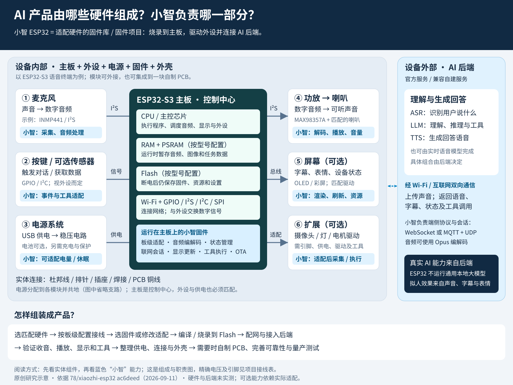
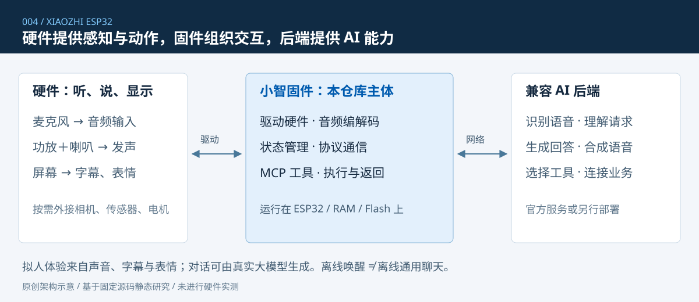
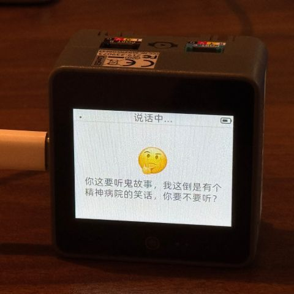

# 004 · 小智 ESP32：从硬件到 AI 交互

**小智 ESP32 是一个适配硬件的固件库，更完整地说，是可编译、烧录到 ESP32 主板的嵌入式固件项目。** 它通过板级适配与驱动操控麦克风、功放、喇叭、屏幕及外设，处理设备端音频、联网和交互状态，并连接兼容 AI 后端，让硬件组成能听、能说、能显示、能执行动作的 AI 交互产品。

“模拟 AI 交互”可以用来描述设备通过声音、字幕和表情营造的拟人体验；但不能理解为它只是播放预设答案：联网后端可以调用真实大模型。ESP32 主要负责设备侧处理，不在本地运行通用大语言模型。本项目也不是一套独立包含全部 AI 后端的系统。

## 研究信息

| 项目 | 内容 |
| :--- | :--- |
| 原始仓库 | [78/xiaozhi-esp32](https://github.com/78/xiaozhi-esp32) |
| 作者与许可 | 78 及贡献者；MIT |
| 研究提交 | [ac6deed3d8e75348475364bf40ad953c6cd48054](https://github.com/78/xiaozhi-esp32/tree/ac6deed3d8e75348475364bf40ad953c6cd48054) |
| 源码版本标记 | 2.5.0；来自该提交的 CMakeLists.txt，不等同于已验证发布包 |
| 研究日期 | 2026-09-11 |
| 研究状态 | 已总结 |
| 验证范围 | 官方资料与固定源码静态核对；没有硬件、未编译烧录固件、未实测 AI 后端 |
| Web 说明 | [运行方式](web/README.md)；交互教学页面，不是设备模拟器 |
| 演示状态 | [Web 已部署](https://yydshly.github.io/0912_codex_project/004-xiaozhi-esp32/)；2026-09-11 通过远端构建与在线文件校验 |

## 一句话定位与能力边界

可以把小智通俗地称为“驱动硬件实现 AI 交互的能力库”，更准确的工程名称是 **ESP32 嵌入式语音终端固件**。它已经包含主程序、状态管理、驱动适配、联网协议、音频服务、显示和工具执行入口，不只是几个可调用函数。

| 层次 | 负责什么 | 是否属于本仓库主体 |
| :--- | :--- | :--- |
| 物理硬件 | 感知声音、发声、显示、产生动作 | 否；需要采购、连接或自行设计 |
| 小智固件 | 驱动硬件，管理聆听与说话，发送声音，接收结果，执行工具 | 是 |
| 兼容后端 | 连接认证、语音识别、模型推理、语音生成、工具编排 | 否；官方服务或另行部署的兼容服务 |
| 外部业务服务 | 知识库、家居系统、业务查询等 | 否；需要另外接入 |

本地唤醒不等于离线通用聊天。表情动画不等于识别了人的真实情绪。支持拍照问答不等于持续视频理解。支持电机工具不等于自动拥有机器人导航、避障和平衡算法。只有软件、硬件和后端都满足条件，对应能力才完整成立。

## AI 产品硬件组成 × 小智固件能力引导图



[下载引导图 PNG](assets/hardware-firmware-guide.png) · [打开可缩放 SVG](assets/hardware-firmware-guide.svg)

**先看“买哪些硬件”，再看“固件让这些硬件做什么”。** 主板是控制中心；麦克风负责录音，功放与喇叭负责发声，屏幕负责显示，电源负责供电。CPU、运行内存和 Flash 通常已经位于主控芯片、模组或主板上，不需要像组装台式机那样逐个插装。

| 产品组成 | 硬件提供什么 | 小智固件补上什么 | 还需你完成什么 |
| :--- | :--- | :--- | :--- |
| 主板与存储 | 计算、运行缓存、程序存储及通信接口 | 在 CPU 上运行，管理任务、状态、资源和板级接口 | 选择匹配的型号、内存容量与板级配置 |
| 麦克风 | 声音转电信号或数字音频 | 采集、可选音频前处理、编码与发送 | 麦克风类型、引脚、供电及声学位置匹配 |
| 功放与喇叭 | 将音频转换为足够响的声音 | 解码、播放及音量控制 | 匹配功放、喇叭阻抗与供电 |
| 屏幕与按键 | 显示画面、产生输入事件 | 字幕、表情、状态界面和按键响应 | 适配屏幕驱动、尺寸、按键引脚与交互 |
| 电源与外壳 | 稳定供电、固定保护、声学结构 | 支持时提供电量显示和休眠控制 | 电源电路、充电保护、结构与噪声处理 |
| 扩展模块 | 拍照、检测环境、发光或产生动作 | 通过驱动和工具接口对接设备能力 | 新增或复用驱动、工具注册及后端调用策略 |
| 网络与 AI 后端 | 无线连接、语音识别、模型推理和语音生成 | 端侧连接认证、协议会话、音频及消息传输 | 配网并接入兼容服务；后台模型与业务另外部署 |

最小语音原型通常是 **受支持主板 + 麦克风 + 音频输出电路与喇叭 + 稳定供电 + 小智固件 + 网络与兼容后端**。屏幕、摄像头、电池和电机属于按产品需求增加的部分；已有集成板可省去部分外接模块。图中箭头表示主要功能连接，不是完整电气接线图，精确连接以本文接线表和所购模块资料为准。

**组装与开发是两条相互配合的工作：** 硬件先解决型号、电压、引脚、音频和结构匹配；软件再选用已有板级适配，或修改适配代码，编译并烧录到主板 Flash。烧录后 CPU 持续执行固件，经配网与后端联调完成整机功能。改用自制主板时，固件也要跟着实际电路调整；“所有开发都在主板上”不完全准确，后端 AI 与业务代码在服务器侧开发。

## 完整系统与三条交互链路



### 语音对话链路

用户说话 → 麦克风采集 → 固件进行必要的音频处理与 Opus 编码 → 上传到兼容后端 → 后端识别与理解 → 生成语音 → 固件解码播放；字幕与表情通过消息驱动屏幕更新。也可由兼容后端对接实时语音模型，不一定拆成三个独立模型服务。

### 工具与动作链路

用户说“把音量调到 30” → 后端理解意图 → 调用 `self.audio_speaker.set_volume`，参数为 `volume=30` → 固件调用音频接口 → 返回执行结果。端侧 MCP 的角色是服务端，后端发现并调用这些工具；MCP 不负责理解人话，也不是音频压缩格式。

### 视觉链路

后端调用 `self.camera.take_photo` → 设备采集图片 → 向配置的视觉接口提交图片及问题 → 返回解释结果。需要受支持摄像头、固件配置和视觉后端；当前研究的基础 OLED 面包板方案不包含摄像头。

以上链路依据 [通信协议](https://github.com/78/xiaozhi-esp32/blob/ac6deed3d8e75348475364bf40ad953c6cd48054/docs/websocket_zh.md)、[MCP 实现](https://github.com/78/xiaozhi-esp32/blob/ac6deed3d8e75348475364bf40ad953c6cd48054/main/mcp_server.cc)和[相机实现](https://github.com/78/xiaozhi-esp32/blob/ac6deed3d8e75348475364bf40ad953c6cd48054/main/boards/common/esp32_camera.cc)整理。

## 能力清单与成立条件

| 能力 | 用户可感知效果 | 条件与边界 |
| :--- | :--- | :--- |
| 语音问答 | 提问、聊天、听取回答 | 需要兼容后端；回答质量取决于模型及配置 |
| 唤醒与连续交互 | 唤醒词或按键启动、回答后继续听 | 唤醒模型、芯片与固件配置需支持 |
| 插话与全双工 | 设备说话时仍能接收用户声音 | 需要回声处理、硬件和后端配合；基础拼装方案不保证自然插话 |
| 字幕与表情 | 显示识别文字、回答、设备状态 | 屏幕、驱动及资源匹配；OLED 与彩屏效果不同 |
| 设备控制 | 查询状态、调音量，条件支持时调亮度、主题 | 工具须实际注册；无背光的 OLED 不应承诺通用背光调节 |
| 摄像头问答 | 对照片中的物品提问 | 需要摄像头与视觉服务，不能视为持续视频理解 |
| 外设动作 | 灯光、GPIO、舵机等 | 需要对应驱动、电路、工具与执行反馈 |
| 联网、升级与电源管理 | 配网、更新固件、电量反馈 | 随板型与配置变化；USB 供电板不自动具备电池管理 |
| 外部业务连接 | 家居、知识库、业务查询等 | 后端或外部 MCP 服务集成，不是刷入固件即全部具备 |

声纹识别及其他生态能力出现在上游功能介绍中；本研究未验证具体后端、部署方式和质量，不将其算作每块板子的默认本地能力。

## 核心软件模块与技术

| 模块 / 技术 | 用途 | 固定版本源码入口 |
| :--- | :--- | :--- |
| `Application` | 协调启动、待机、连接、聆听、说话、升级等状态与事件 | [application.cc](https://github.com/78/xiaozhi-esp32/blob/ac6deed3d8e75348475364bf40ad953c6cd48054/main/application.cc) |
| `Board` | 向上提供统一音频、屏幕、相机、网络接口，向下适配实际硬件 | [board.h](https://github.com/78/xiaozhi-esp32/blob/ac6deed3d8e75348475364bf40ad953c6cd48054/main/boards/common/board.h) |
| `AudioService / AudioEngine` | 音频采集、处理、编解码、缓冲和播放 | [音频架构](https://github.com/78/xiaozhi-esp32/blob/ac6deed3d8e75348475364bf40ad953c6cd48054/main/audio/README.md) |
| ESP-IDF / FreeRTOS / C++ | 嵌入式框架、任务调度与实现语言 | [启动入口](https://github.com/78/xiaozhi-esp32/blob/ac6deed3d8e75348475364bf40ad953c6cd48054/main/main.cc) |
| PCM / Opus | PCM 表示采样声音；Opus 压缩音频供网络传输 | [音频服务](https://github.com/78/xiaozhi-esp32/blob/ac6deed3d8e75348475364bf40ad953c6cd48054/main/audio/audio_service.cc) |
| AFE / WakeNet / VAD / AEC | 音频前端、唤醒、人声检测、回声消除 | [音频架构](https://github.com/78/xiaozhi-esp32/blob/ac6deed3d8e75348475364bf40ad953c6cd48054/main/audio/README.md) |
| WebSocket | 同一连接传输二进制音频和 JSON 控制消息 | [协议说明](https://github.com/78/xiaozhi-esp32/blob/ac6deed3d8e75348475364bf40ad953c6cd48054/docs/websocket_zh.md) |
| MQTT＋UDP | MQTT 传控制消息，UDP 传音频 | [协议说明](https://github.com/78/xiaozhi-esp32/blob/ac6deed3d8e75348475364bf40ad953c6cd48054/docs/mqtt-udp_zh.md) |
| MCP / JSON-RPC | 公布工具名称和参数，接收调用，返回结果 | [工具使用](https://github.com/78/xiaozhi-esp32/blob/ac6deed3d8e75348475364bf40ad953c6cd48054/docs/mcp-usage_zh.md) |
| Display / LVGL | 字幕、状态、表情与部分屏幕界面 | [板级适配说明](https://github.com/78/xiaozhi-esp32/blob/ac6deed3d8e75348475364bf40ad953c6cd48054/docs/custom-board_zh.md) |

S3 / P4 / S31 与较小芯片采用的输入引擎不同；不能将一种平台的回声处理能力外推到全部平台。固定版本音频说明还明确禁用了 WebRTC / NSNet 降噪，因此不应笼统声称默认具备所有降噪算法。

## 先看一块真实主板


图中左侧银色罩所在部分是主控模组，模组端部是天线区域；中间有稳压与指示电路，右侧有 USB、下载和复位按键，上下两排是外设连接用的排针。CPU、Flash 和 PSRAM 的位置与容量由芯片及模组具体型号决定，不能把银色罩整体当成一颗裸 CPU，也不能把普通开发板一律视为 N16R8。

这块板本身没有完成小智产品所需的麦克风、喇叭和屏幕。它提供计算、存储、连接、供电转换和调试入口，外设需要另外连接。

| 图上部件 | 作用 | 是否可以直接拔下来 |
| :--- | :--- | :--- |
| 主控模组与天线区 | CPU 运行程序；配套存储与无线电路完成设备侧工作 | 焊在主板上，不是插拔式 CPU |
| LDO 稳压器 | 将 5V 转换成 3.3V | 焊接元件 |
| USB 转串口芯片 | 下载程序与读取调试信息 | 焊接元件 |
| USB 插座 | 供电、通信、烧录的接口 | 插座焊在板上，线缆可拔插 |
| BOOT / RESET | 进入下载模式、重启 | 按钮焊在板上 |
| 电源灯与 RGB 灯 | 电源指示和程序控制反馈 | 焊接元件 |
| 两侧排针 | 引出电源、地和可用 GPIO | 排针通常焊在板上，跳线可拔插 |

CPU、RAM、Flash 的区别：CPU 执行程序；RAM / PSRAM 暂存运行数据，断电后丢失；Flash 保存固件和资源，断电后仍在。屏幕和音频缓存会占用内存，但增加 PSRAM 不会自动让 ESP32 运行通用大语言模型。长期对话记忆通常由后端实现。

主板、模组、芯片也不同：芯片是封装器件；模组集成芯片及部分配套电路；开发板在模组周围增加供电、下载、按键和排针；产品主板则按实际产品尺寸与功能集成电路。

## 从部件拼成产品


这张照片用于辨认结构，不作为逐线施工图。照片中的具体主板版本及左下额外扩展板型号未完全确认；下文 Wi-Fi 方案不需要额外通信扩展板。图片来源及许可范围见 [素材说明](assets/README.md)。

照片中央是开发板，上方有拾音模块与 OLED，左侧紫色板是功放，最右侧是喇叭，主板右侧是按键。白色面包板用于临时连接，本身不计算，也不运行软件。模块在照片中的外观并不足以保证芯片型号一致。

基础产品所需关系可以写成：麦克风 → 主板 → Wi-Fi 后端；后端 → 主板 → 功放 → 喇叭；主板 → 屏幕。所有模块还需要适配的供电和公共地。屏幕、相机、传感器、电机属于按需要添加的外部能力，软件不能替代缺失硬件。

## DIY 采购与兼容性

以下是面包板 Wi-Fi 语音原型的选型方向，不是已经验证的整套采购订单。实际下单前需核对商家板图、芯片、引脚、电压和固件分区；不记录未经核实的价格。

| 部件 | 数量 | 建议规格及作用 |
| :--- | :--- | :--- |
| ESP32-S3 开发板 | 1 | 可考虑带 16MB Flash、8MB PSRAM 的 N16R8 兼容板，确认所需 GPIO 引出、USB 供电方式、内存模式和排针已焊；官方实物示意图不代表该容量型号 |
| INMP441 麦克风模块 | 1 | I²S 数字拾音，支持 3.3V，优先已焊排针的成品模块 |
| MAX98357A 功放模块 | 1 | 接收 I²S 音频并驱动动圈喇叭；选提供原理图和引脚说明的模块 |
| 动圈喇叭 | 1 | 4Ω / 3W 作为候选，具体功率、音量和供电由功放设计决定 |
| SSD1306 OLED | 1 | 128×64、I²C 四针、支持 3.3V；不要混用 SH1106 或 SPI 屏幕却不改配置 |
| 面包板与杜邦线 | 1 套 | 宽开发板可能需要并排两块面包板；导线尽量短，保留接线空间 |
| USB 数据线与电源 | 1 套 | 烧录用数据线；运行可考虑可靠的 5V/2A 电源，还需确认开发板及导线的供电承载能力 |
| 外壳、固定件、可选按键 | 按需 | 验证成功后增加；不遮挡麦克风声孔与天线区域 |

基础版先使用 USB，不加入电池、充电管理、摄像头或运动机构。做便携款需新增电池、充电、保护和电源路径设计；做拍照问答需新增相机适配；做机器人需新增驱动电路和机械结构。

## 接线参考：每根线接到哪里

以下信号线来自固定版本 `bread-compact-wifi/config.h`，使用默认分离的输入 / 输出 I²S 配置；屏幕变体为 `bread-compact-wifi-128x64`。引脚是 GPIO 编号，不是从排针一端数起的物理位置。模块电源、声道和增益脚还必须核对实际模块资料。

| 外接模块 | 模块引脚 | 主板连接 / 说明 |
| :--- | :--- | :--- |
| INMP441 | VDD / GND | 3V3 / GND；不可把麦克风 VDD 接到 5V |
| INMP441 | L/R | GND，选择左声道，与参考音频配置匹配 |
| INMP441 | WS / SCK / SD | GPIO4 / GPIO5 / GPIO6 |
| SSD1306 OLED | VCC / GND | 3V3 / GND，前提是所选显示模块支持该供电 |
| SSD1306 OLED | SDA / SCL | GPIO41 / GPIO42 |
| MAX98357A | VIN / GND | 开发板可用的 USB 5V 电源轨 / GND；核对实际电源路径 |
| MAX98357A | DIN / BCLK / LRC | GPIO7 / GPIO15 / GPIO16 |
| MAX98357A | SD / MODE | 参考模块允许时接 3V3，启用并选择左声道；核对模块板载上下拉电路，不套用于其他功放 |
| MAX98357A | GAIN | 参考模块悬空为默认增益；以实际模块说明为准 |
| 喇叭 | 两根线 | 分别接功放 SPK+、SPK−；任何一端都不接 GND |

MAX98357A 的 SD 是关断与声道选择脚，INMP441 的 SD 是数据输出脚；同名不代表同功能。所有模块共地，连接或拆线先断电，按丝印而非线色接线。使用 USB 供电时，不应未经核对再从另一电源向 5V / 3V3 脚反向供电。

**版本差异必须处理：**官方 DevKitC-1 v1.1 的 RGB 灯是 GPIO38，参考面包板配置中 `BUILTIN_LED_GPIO` 是 GPIO48，选择该官方板需修改适配。部分八线存储版本占用 GPIO35～37，不能随意外接。Flash 容量、PSRAM 模式、屏幕类型也必须与构建和分区一致。因此不能把上述采购列表理解为“任意 S3 板加任意固件即可运行”。

依据：[小智引脚配置](https://github.com/78/xiaozhi-esp32/blob/ac6deed3d8e75348475364bf40ad953c6cd48054/main/boards/bread-compact-wifi/config.h)、[屏幕变体](https://github.com/78/xiaozhi-esp32/blob/ac6deed3d8e75348475364bf40ad953c6cd48054/main/boards/bread-compact-wifi/config.json)、[INMP441 厂商数据手册](https://invensense.tdk.com/wp-content/uploads/2015/02/INMP441.pdf)、[功放模块厂商说明](https://learn.adafruit.com/adafruit-max98357-i2s-class-d-mono-amp/pinouts)、[开发板文档](https://docs.espressif.com/projects/esp-dev-kits/en/latest/esp32s3/esp32-s3-devkitc-1/user_guide_v1.1.html)。

## 导线怎样连接：插接、焊接与 PCB

| 连接方式 | 实际做法 | 使用阶段 |
| :--- | :--- | :--- |
| 杜邦线 | 线头插到对应公针或母座，选对公母组合 | 可拆换原型 |
| 面包板 | 引脚插入孔内，由内部金属夹片接通特定孔组 | 免焊临时连接；不是所有孔相通，电源轨也可能中间断开 |
| 焊接导线 | 用焊锡把导线固定到焊盘 | 无连接器的部件、固定连接 |
| 插座与排线 | 喇叭线、电池线、屏幕排线插入匹配插座 | 产品整机；连接器形状、间距、极性需匹配 |
| PCB 铜线 | 板内铜层把焊接元件电气连接 | 自制和量产主板 |

一根插接信号线的完整路径是：模块电路 → 已焊排针 → 杜邦线 → 主板排针 → 主板铜线。排针与板通常焊接，但杜邦线与排针之间可拔插。买“已焊排针”模块可以减少原型阶段的焊接工作。CPU、功放芯片和电容等已经焊在模块上，不是可以直接拔掉的积木。

## 从采购到第一台样机

1. 定义基础目标：USB 供电、Wi-Fi 语音问答、OLED 显示；明确原型不承诺远场和全双工质量。
2. 根据板型、内存、引脚和模块资料确认物料；记录每根线的起点、终点和电压。
3. 断电接线，检查 3V3、5V、GND 与喇叭输出，没有错误连接或明显短接。
4. 先验证主板下载和启动，再逐项检查屏幕、低音量播放、麦克风录音，便于定位故障。
5. 构建或选择与硬件一致的小智固件，通过正确 USB 下载接口烧录。固件写进 Flash，启动后由主控执行。
6. 按设备提示配网，接入兼容后端；默认官方服务的设备按提示完成激活 / 绑定和模型配置。
7. 测试“你好”、连续问答、“音量调到 30”、网络断开后恢复；记录真实结果，不用 AI 口头回答代替硬件成功证据。
8. 固定进外壳，重新检查拾音与播放，避免喇叭振动、回声或遮挡天线引入新问题。

固定研究版本最低要求 ESP-IDF 6.0.1，推荐 6.1；不沿用旧版 IDF 5.x 教程。面包板构建示意如下，须先完成开发环境、依赖及板型配置；本研究未执行固件构建：

```text
python scripts/build.py bread-compact-wifi --name bread-compact-wifi-128x64
idf.py flash
```

上述命令在上游源码根目录及已配置的 ESP-IDF 环境运行，不是在本研究目录运行。预编译固件如有对应版本，可按上游烧录说明使用；不虚构当前下载包或烧录地址。复位与下载按键组合、USB 接口类型应以手上板子的说明为准。

## 真实产品案例：CoreS3



M5Stack CoreS3 把 ESP32-S3、16MB Flash、8MB PSRAM、2 英寸 320×240 触摸屏、双麦克风、ES7210 音频采集、AW88298 功放、1W 喇叭及 GC0308 摄像头集成到一个设备中。它是“现成完整开发设备”的例子，不能代表前述裸开发板也已经包含这些外设。

小智提供专用 `m5stack-core-s3` 适配。该固定源码将正常运行时的短触屏幕关联到聊天状态切换。进入下载模式的方法是长按复位约 3 秒，指示灯亮绿色后松开；实际流程以型号与厂商说明为准。相机等功能仍需后端和配置支持，照片也不能证明本次研究版本已在该硬件上通过测试。

操作关系：连接电脑 → 选择 CoreS3 对应固件 → 烧录 → 配置网络与后端 → 发起对话。开发完成后设备可以独立供电联网，不需要一直连接开发电脑。[厂商规格](https://docs.m5stack.com/en/core/CoreS3)、[适配与烧录说明](https://github.com/78/xiaozhi-esp32/blob/ac6deed3d8e75348475364bf40ad953c6cd48054/main/boards/m5stack/core-s3/README.md)。

## 不买整机：自己设计主板

| 深度 | 购买什么 | 自己负责什么 |
| :--- | :--- | :--- |
| 模块原型 | 开发板、拾音模块、功放模块等 | 接线、固件配置、调试和外壳 |
| 自制产品主板 | 主控模组、麦克风、功放芯片、电源器件等 | 原理图、PCB、元件选型、制造文件、板级适配和整机调试 |
| 从主控芯片设计 | 主控芯片及存储、晶振、射频等器件 | 除外围外，承担更多主控最小系统与射频设计 |

自研产品通常仍采购现成芯片和屏幕，自主设计的是系统、电路、板子和软件。无需把已有开发板上的元件拆焊后搬到新板上；按自己的 BOM 采购器件，由工厂制造 PCB 并贴装。

第一块自制主板可采用主控模组，集中设计 USB 供电、稳压、启动与下载、麦克风、功放、屏幕接口和按键。若采用裸芯片，还需按芯片方案处理时钟、存储、供电与射频。元件布局会影响电源稳定、无线与音频，不能只把“导线换成铜线”理解为机械复制。

完整开发顺序：产品规格 → 元件清单 BOM → 原理图 → PCB 布局布线 → 电气与设计规则检查 → 输出制造文件 → 打样焊接 → 上电检查与固件下载 → 驱动适配 → 音频与网络联调 → 外壳 → 根据样机结果迭代。

小智提供的复用入口是板级类及初始化代码，例如提供 `GetAudioCodec()`、`GetDisplay()`、`GetCamera()`、网络接口，并注册新增工具。硬件量产文件、声学设计、机械结构和完整业务后端需要另行完成。[自定义开发板指南](https://github.com/78/xiaozhi-esp32/blob/ac6deed3d8e75348475364bf40ad953c6cd48054/docs/custom-board_zh.md)、[乐鑫原理图指南](https://docs.espressif.com/projects/esp-hardware-design-guidelines/en/latest/esp32s3/schematic-checklist.html)、[PCB 指南](https://docs.espressif.com/projects/esp-hardware-design-guidelines/en/latest/esp32s3/pcb-layout-design.html)。

## 真正的工程难点

宏观链路容易理解；难点是硬件、任务、网络和模型响应在现实条件下稳定配合。主板设计很重要，但不是唯一难点。

| 交界处 | 问题 | 用户感知 |
| :--- | :--- | :--- |
| 麦克风与喇叭 | 回声、噪声、拾音位置、音腔 | 听不清、误唤醒、插话失败 |
| 采集、编解码与网络 | 队列堆积、任务调度、内存占用 | 卡顿、断音、延迟 |
| 聆听与说话状态 | 新输入、打断、播放结束事件重叠 | 抢话、不再聆听、旧声音残留 |
| 电源与无线 / 功放负载 | 电流变化、压降、连接接触不良 | 重启、杂音、不稳定 |
| 固件与板型 | 引脚、存储、屏幕、音频芯片不匹配 | 无画面、无声、无法启动 |
| AI 工具与执行结果 | 参数正确但硬件没有完成动作 | 回答“完成”但实际未执行 |
| 原型与外壳 | 安装方式改变声学、散热和天线环境 | 裸板可用、装壳后体验下降 |

本研究没有端到端延迟、识别准确率、唤醒距离、续航、全双工成功率或量产可靠性数据。声纹和自然插话等能力尤其不能以宣传视频替代实测。

## 使用场景与扩展方向

以下属于基于现有架构的应用判断，不是仓库默认交付的完整业务产品。

| 场景 / 扩展 | 复用的已有基础 | 还需要开发 |
| :--- | :--- | :--- |
| 桌面聊天、互动玩具 | 音频交互、字幕、表情 | 角色与内容、外观、实际体验验证 |
| 语言练习、教学问答 | 免手持对话入口 | 教学流程、内容与效果评估 |
| 展馆讲解、企业问答 | 固定场所语音终端 | 后端知识库检索、内容维护与回答依据 |
| 家居控制面板 | 工具调用与状态查询 | 平台连接、设备映射、执行反馈和权限 |
| 机器人交互 | 语言到动作工具 | 电机、传感器、控制算法和机械结构 |
| 视觉识物或读字 | 拍照工具与网络传输 | 相机适配、视觉模型、光照与成像验证 |
| 更自然的对话 | 音频处理、会话状态 | 声学、AEC、模型与后端协作调优 |
| 产品化运营 | 配网、升级等已有机制 | 设备管理、日志、版本发布、故障处理和生产测试 |

## 没有硬件怎样研究

1. 先理解硬件、固件、后端三层职责，用“音量调到 30”追踪输入、工具调用和执行返回。
2. 阅读顺序：`main.cc` → `application.cc` → 协议文档 → `mcp_server.cc` → 音频架构 → 一个具体板型；第一遍聚焦模块关系，不逐行啃所有驱动。
3. 可用 [py-xiaozhi](https://github.com/huangjunsen0406/py-xiaozhi) 等独立客户端在电脑上体验兼容交互。它不是本仓库固件的硬件模拟器；本研究未安装验证该客户端。
4. 本项目 Web 用组件按钮和流程步骤辅助理解，不会访问麦克风、发送音频、调用模型或控制真实主板。
5. 有硬件后再验证供电、录音、播放、显示、联网、工具执行及异常恢复，补入实测记录。

## 验证范围与后续记录

- 已完成：固定版本官方文档与核心源码静态核对；真实图片出处记录；本次讨论形成的术语澄清、硬件路径与 DIY 接线参考。
- Web 的构建、资源和链接检查结果另见 [Web 说明](web/README.md)，它们不构成固件或硬件验证。
- 未完成：固件编译、烧录、任何实物接线、音频和性能测量、官方或自部署后端实测。
- 计划验证：确定实际板号与模块清单后，逐项验证电源、启动、屏幕、播放、录音和会话，再验证外壳及长时间运行。
- 源码核对依据与容易误解的结论见 [研究笔记](notes/README.md)。

## 参考资料

- [小智项目说明](https://github.com/78/xiaozhi-esp32/blob/ac6deed3d8e75348475364bf40ad953c6cd48054/README_zh.md)
- [乐鑫 DevKitC-1 v1.1 官方说明](https://docs.espressif.com/projects/esp-dev-kits/en/latest/esp32s3/esp32-s3-devkitc-1/user_guide_v1.1.html)

[返回研究总索引](../../README.md)
