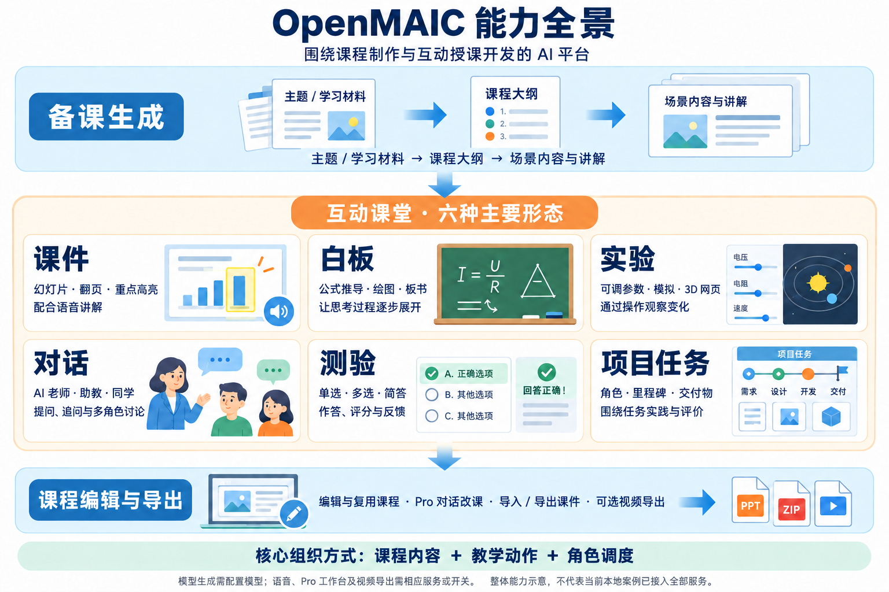

# 005 · OpenMAIC：把资料变成 AI 互动课堂

**OpenMAIC 是一个 AI 课程创作与互动授课平台：把主题或学习材料组织成课件、测验、交互实验和项目任务，再由 AI 老师与 AI 同学进行讲解和讨论。** 核心是模型生成结构化课程与教学动作，程序负责渲染、播放、角色调度和保存。

本子项目通过可操作的「欧姆定律互动课堂」、原创能力图、官方示例和固定源码分析展示该库。课堂课件真实接入官方渲染组件，其他互动为案例实现。**官方素材是上游展示；角色对话是预设脚本，尚未配置模型服务或实测完整生成流程。** [八环节体验路线](notes/05-case-study.md) · [本地运行](web/README.md)

**最值得关注的特点：** 内容与动作分开生成；预生成讲解和现场回答共用执行层；导演按轮次组织多角色；实验运行网页代码，项目任务维护提交与评价状态。因此，差异涉及生成协议、运行和反馈，不只是展示界面。多个角色可共用同一模型，六种教学效果也不是六个独立模型。

**比较的意义是选用产品与确定开发职责。** 资料学习看 NotebookLM / Gemini Notebook，自建研究工作台看 Open Notebook，多来源接入与检索看 SurfSense，持续辅导与学习状态看 DeepTutor，互动课程与授课编排看 OpenMAIC。能力有重叠，不能只凭“有没有问答、测验或语音”选型；本次没有同题效果排名。

先读[理解汇总：能力、原理、案例、选型与扩展](notes/07-understanding.md)，再查[五个产品的详细对比及来源](notes/04-comparison.md)。

## 研究信息

| 项目 | 内容 |
| :--- | :--- |
| 原始仓库 | [THU-MAIC/OpenMAIC](https://github.com/THU-MAIC/OpenMAIC) |
| 原作者 / 组织 | THU-MAIC 及贡献者 |
| 上游许可证 | MIT；引用素材保留[上游许可](assets/UPSTREAM-LICENSE.txt) |
| 研究版本 / Commit | package.json 标记 1.0.1；[d5be3933176247feebf4007f6e31e20b93871609](https://github.com/THU-MAIC/OpenMAIC/tree/d5be3933176247feebf4007f6e31e20b93871609) |
| 开始 / 最近研究日期 | 2026-09-11 |
| 研究状态 | 已总结 |
| 验证范围 | 官方文档与固定源码核对；安装官方 renderer / DSL，完成案例计算、评分、结构校验与组件服务端渲染检查；未运行上游完整应用、未调用模型或验证学习成效 |
| 技术栈 | Next.js、React、TypeScript、LangGraph、模型适配层；浏览器存储或可选 PostgreSQL / S3 |
| 本研究 Web 演示 | 本地互动课堂 + 能力总览；[网页运行说明](web/README.md)，公网未发布 |
| 上游体验入口 | [open.maic.chat](https://open.maic.chat/)；官方链接，功能与访问条件未实测 |

## 能力一览



本研究策划并用 AI 辅助绘制的能力示意；课堂中的六项是并列能力，不表示必须依次执行，也不表示本地案例已接入全部服务。[图片来源](assets/README.md) · [更详细的流程关系图](assets/capability-map.svg)

| 能力 | 用户能做什么 | 实现方式与成立条件 |
| :--- | :--- | :--- |
| 材料转课程 | 输入主题或上传材料，生成大纲和页面 | 按配置的解析器提取材料，再调用模型；文件格式支持取决于解析服务 |
| AI 讲课 | 听讲解，看重点高亮、激光笔和白板公式 | 课程内容配合语音、绘图等动作；语音依赖可用 TTS 服务 |
| 多角色讨论 | 提问、追问，参与老师、助教、同学的讨论 | 导演选择发言角色；角色结合上下文生成回答和动作 |
| 测验反馈 | 做单选、多选、简答题，查看结果 | 简答题调用模型评分；不能据此承诺正式考试评分可靠性 |
| 交互实验 | 调整参数，观察模拟、3D 场景或编程页面的变化 | 模型生成网页程序，在 iframe 中运行；计算正确性需另外核验 |
| 项目式学习 PBL | 扮演角色，围绕里程碑完成任务和交付物 | 结构化项目规划与对话、提交、评价界面 |
| Pro 工作台 | 通过对话规划课程、增删改页面、管理材料与媒体 | 服务端 Agent 调用经过校验的工具；需启用相应开关与数据库环境 |
| 导入与导出 | 复用 PPTX，导出课件、交互页面或视频 | PPTX 导入和视频出口有开关；MP4 需独立 Chromium / FFmpeg 渲染服务 |

依据：[官方功能说明](https://github.com/THU-MAIC/OpenMAIC/blob/d5be3933176247feebf4007f6e31e20b93871609/README.md)、[功能开关](https://github.com/THU-MAIC/OpenMAIC/blob/d5be3933176247feebf4007f6e31e20b93871609/lib/config/feature-flags.ts)。新工作台说明以英文 README 和源码为准；本次中文 README 的动态列表更新较慢。

## 看得见的效果

### 1. 课件讲解


上游提供的课堂动图，用于观察课件与讲解的产品形态；不能据此推断任意主题生成的准确性、成功率或耗时。

### 2. 可以操作的实验页面


上游太阳系示例中可见速度、方向与视角控件。这里引用的是静态截图，实际交互与天文计算精度未在本次验证。

### 3. 项目式学习


上游 PBL 动图用于理解产品形态，不保证素材与当前固定提交的全部界面细节一致。源码已有项目规划、提交、评价等模块。

另见上游[测验动图](https://github.com/THU-MAIC/OpenMAIC/blob/d5be3933176247feebf4007f6e31e20b93871609/assets/quiz.gif)与[讨论动图](https://github.com/THU-MAIC/OpenMAIC/blob/d5be3933176247feebf4007f6e31e20b93871609/assets/discussion.gif)。本项目只保存三份代表性原始素材，来源与许可见[素材记录](assets/README.md)。

## 技术原理

1. **提取材料并规划大纲。** 解析支持的输入，得到模型可处理的材料，规划课程场景。
2. **分别生成内容与动作。** 内容决定页面展示什么；动作决定说什么、指哪里、画什么、何时讨论。
3. **组装为课程数据。** 用 Stage、Scene、Content、Actions 等结构保存，提供校验和版本迁移机制。
4. **播放与现场回答共用动作引擎。** 预生成讲解和讨论时新生成的动作都进入统一执行层。
5. **导演按轮次调度角色。** 默认 LangGraph 路径每个请求至多执行一轮“导演 → 角色”；前端串联请求，直到轮到用户或结束。
6. **工作台持续修改课程。** Pro 服务端 Agent 通过工具更新课程，数据库保存会话并支持恢复与追加指令。

多个角色可以使用同一个底层模型，差异主要来自人设、上下文、声音和可用动作。默认讨论路径与实验性的 Pi 路径需要区分，不能看到实验代码就认为默认启用。

详细模块、数据流与固定源码入口见[技术原理与源码地图](notes/01-architecture.md)。进一步阅读[六个模块的底层原理](notes/06-module-principles.md)：逐项拆解课件、白板、实验、对话、测验和 PBL 的输入、生成结果、执行机制与失败处理；也可先看[六模块原理全图](assets/module-principles-map.png)。

## 使用场景与扩展方向

与此前研究的产品相比：**NotebookLM 更围绕资料研究与学习成果，DeepTutor 更围绕学习路径与状态，OpenMAIC 更围绕课堂场景与教学动作。** 三者能力有重叠，不能只按“能否问答、出题或语音互动”区分；NotebookLM 已更名为 Gemini Notebook。详见[同类产品对比与来源](notes/04-comparison.md)，另补 Open Notebook 和 SurfSense 的区别。

| 场景 | 示例 | 需要补充的工作 |
| :--- | :--- | :--- |
| 个人自学 | 论文或项目说明变成可追问的小课 | 核对来源、术语及生成解释 |
| 教师备课 | 生成课件、题目和实验初稿 | 教师审核难度、准确性和教学顺序 |
| 企业培训 | 产品手册转新人培训课程 | 内容更新机制、身份权限和课程发布流程 |
| 科普教学 | 用可调参数的页面解释算法或物理概念 | 验证交互代码及模型假设 |
| 项目实践 | 按角色和里程碑完成任务 | 明确真实交付标准，结合人工评价 |
| 教育产品开发 | 复用生成、编辑与渲染模块 | 接入现有产品、学习记录和业务系统 |

优先扩展方向：**材料引用可追溯 → 教师审核 → 学习记录与错题诊断 → 针对性补课**。其他方向包括经过测试的学科实验模块、规则化评分、组织账户与权限，以及按阶段选择模型和缓存媒体以控制成本。

以上是应用判断和扩展建议，不代表上游已完整实现。详见[效果、场景与扩展方向](notes/02-effects-and-roadmap.md)。

## 能力边界

- **展示效果与教学成效不同。** 本次没有验证知识掌握提升、课程生成成功率、延迟或费用。
- **结构校验不等于知识正确。** 数据可解析、网页能运行，仍可能包含事实或计算错误。
- **评分有明确的降级行为。** 当前简答题接口在模型输出无法解析时回退为满分的 50% 和通用评语；正式考核需要修改并验证该行为。
- **可选能力需要对应配置。** Pro、PPTX 导入、视频导出等受开关或额外服务约束。
- **组织部署需要身份与隔离设计。** 上游基础持久化开发令牌不提供真正的用户隔离，接入数据库不等于完成多租户支持。

具体证据与待验证事项见[验证记录](notes/03-validation.md)。

## 本地复现

本项目保存研究文档和展示素材，上游完整应用应放在另外的本地目录。以下命令依据固定版本说明整理，**本次未执行依赖安装、构建或启动**。

```powershell
git clone https://github.com/THU-MAIC/OpenMAIC.git
Set-Location OpenMAIC
git checkout d5be3933176247feebf4007f6e31e20b93871609
pnpm install
Copy-Item .env.example .env.local
# 在 .env.local 配置可用模型；需要语音、解析或媒体时配置对应服务。
pnpm dev
```

| 项目 | 要求 / 状态 |
| :--- | :--- |
| 基础环境 | Node.js ≥ 22.19、pnpm ≥ 10；以固定版本声明为准 |
| 模型 | 至少一个可调用的模型服务，可接外部服务或兼容的本地模型 |
| 本地入口 | 上游默认 localhost:3000；本次未启动 |
| Pro 工作台 | 需要数据库、服务端 Agent runtime 与前端工作台开关；见上游 README |
| MP4 导出 | 可选独立渲染服务，依赖 Chromium 与 FFmpeg |
| 本研究文档 | 直接打开 README，无安装依赖和密钥要求 |

## 研究导航

- [技术原理与源码地图](notes/01-architecture.md)
- [效果、场景与扩展方向](notes/02-effects-and-roadmap.md)
- [验证记录与复现实验建议](notes/03-validation.md)
- [图片来源与上游许可](assets/README.md)
- [同类产品对比与来源](notes/04-comparison.md)
- [欧姆定律八环节互动案例](notes/05-case-study.md)
- [六模块真正底层原理与全图](notes/06-module-principles.md)
- [我们的理解汇总与场景选型](notes/07-understanding.md)
- [能力展示网页与运行说明](web/README.md)

后续可用一份固定材料验证“生成课程 → 听课 → 提问 → 测验 → 导出”，记录模型、耗时、费用、错误及人工修改量，再评估是否适合具体教学任务。

[返回总索引](../../README.md)
