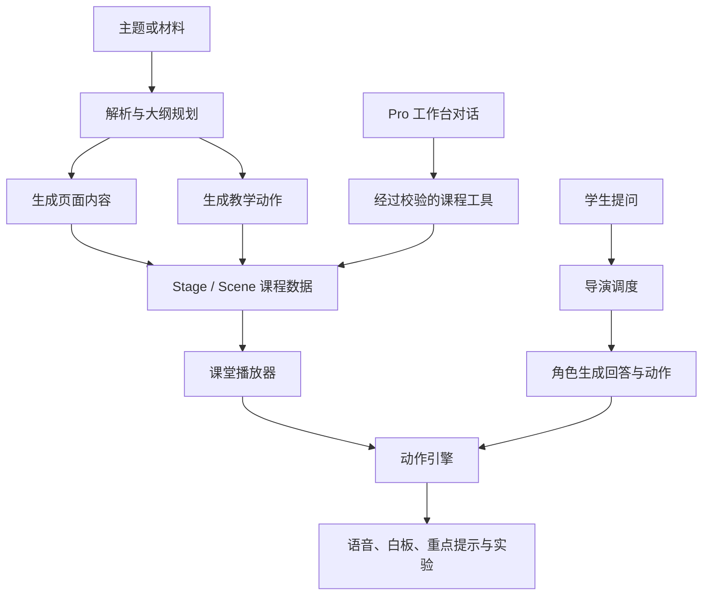

# 技术原理与源码地图

研究日期：2026-09-11。研究版本：1.0.1 / `d5be3933176247feebf4007f6e31e20b93871609`。下文为静态源码分析，未运行模型调用。

## 两个相互连接的过程

**课程创作**把主题和材料变成课程数据；**互动授课**把课程数据播放给学生，并根据提问生成新的回答和教学动作。Pro 工作台增加了通过对话持续编辑课程的入口。



图中是逻辑分工，不代表内容和动作一定并行生成。

## 1. 课程生成与数据协议

经典生成流程先规划大纲，再把大纲项转成场景。生成包拆分出 `generateSceneContent`、`generateSceneActions` 和 `buildCompleteScene`，使内容、动作与组装可以分别调用。模型边界是注入的 `AICallFn`，包本身不决定模型厂商、环境变量或存储位置。

| 概念 | 保存什么 | 作用 |
| :--- | :--- | :--- |
| Stage | 课程整体与相关配置 | 组织课程 |
| Scene | 一段教学场景 | 连接页面内容与执行动作 |
| Content | 幻灯片、测验、互动或 PBL 内容 | 决定展示什么 |
| Action | 讲解、白板、重点提示、讨论等 | 决定何时做什么 |

`@openmaic/dsl` 提供对象模型、结构校验、默认值补充和版本迁移。结构校验保证数据契约，不保证事实、公式、评分或教学安排正确。

来源：[生成包说明](https://github.com/THU-MAIC/OpenMAIC/blob/d5be3933176247feebf4007f6e31e20b93871609/packages/%40openmaic/generation/README.md)、[生成实现](https://github.com/THU-MAIC/OpenMAIC/blob/d5be3933176247feebf4007f6e31e20b93871609/packages/%40openmaic/generation/src/scene-generator.ts)、[组装实现](https://github.com/THU-MAIC/OpenMAIC/blob/d5be3933176247feebf4007f6e31e20b93871609/packages/%40openmaic/generation/src/scene-builder.ts)、[DSL 说明](https://github.com/THU-MAIC/OpenMAIC/blob/d5be3933176247feebf4007f6e31e20b93871609/packages/%40openmaic/dsl/README.md)。

## 2. 多角色讨论怎样运行

默认实现使用 LangGraph 状态图：

```text
START → director → END
                 ↘ agent_generate → END
```

每次请求最多执行一轮导演与角色生成，前端继续发送请求构成多轮讨论。导演可选择某个角色、把发言权交给 USER，或者 END。单角色时使用代码调度，首轮触发指定角色也有跳过导演模型调用的快捷路径。

角色有姓名、人设、头像、优先级、允许的动作与声音设置。这些角色可以共用同一个模型；不能据“多智能体”推断每个角色都是单独训练的模型。

角色生成时接收课堂与对话上下文。流式事件把文字和动作送到前端执行。客户端循环会根据结束、轮到用户、取消或异常等条件退出。

来源：[导演状态图](https://github.com/THU-MAIC/OpenMAIC/blob/d5be3933176247feebf4007f6e31e20b93871609/lib/orchestration/director-graph.ts)、[角色配置](https://github.com/THU-MAIC/OpenMAIC/blob/d5be3933176247feebf4007f6e31e20b93871609/lib/orchestration/registry/types.ts)、[客户端循环](https://github.com/THU-MAIC/OpenMAIC/blob/d5be3933176247feebf4007f6e31e20b93871609/lib/chat/agent-loop.ts)。

## 3. 播放器与动作引擎

播放器包括 idle、playing、paused、live 状态，保存场景与动作位置，并提供讨论、用户打断和进度回调。

动作引擎承接课件播放与在线讨论的指令。高亮、激光笔等效果可以发出后继续执行；语音、白板和讨论等动作需要考虑完成时机。这种共用执行层的设计让预生成内容和现场回答能够出现在同一个课堂中。

来源：[播放器类型](https://github.com/THU-MAIC/OpenMAIC/blob/d5be3933176247feebf4007f6e31e20b93871609/lib/playback/types.ts)、[播放器实现](https://github.com/THU-MAIC/OpenMAIC/blob/d5be3933176247feebf4007f6e31e20b93871609/lib/playback/engine.ts)、[动作引擎](https://github.com/THU-MAIC/OpenMAIC/blob/d5be3933176247feebf4007f6e31e20b93871609/lib/action/engine.ts)。

## 4. 交互实验的实现边界

交互场景是生成的 HTML 页面，通过 iframe 展示；父页面和实验页面用消息通信，让教学动作高亮控件、改变状态或增加提示。宿主设置 sandbox，允许脚本等能力但不加入 allow-same-origin。

因此“太阳系模拟”“算法演示”“小游戏”等属于生成网页程序的不同用途，不能自动获得专业仿真精度。进一步产品化时，应为常用学科接入经过验证的计算模块和实验模板。

来源：[交互渲染器](https://github.com/THU-MAIC/OpenMAIC/blob/d5be3933176247feebf4007f6e31e20b93871609/components/scene-renderers/interactive-renderer.tsx)、[iframe 宿主](https://github.com/THU-MAIC/OpenMAIC/blob/d5be3933176247feebf4007f6e31e20b93871609/components/scene-renderers/InteractiveIframeHost.tsx)。

## 5. Pro 工作台与可替换存储

工作台通过工具读取和修改课程，覆盖规划、页面调整、材料处理和媒体生成。会话存入数据库，运行器提供租约、心跳、恢复、取消与追加指令机制。

基础课程可以使用浏览器存储；服务端部署可使用 PostgreSQL，资产字节可采用 PostgreSQL 或 S3。存储能力被拆成独立包，便于接入不同宿主。

这些功能需要正确配置；前端工作台开关和服务端 runtime 开关是不同条件。实验性 Pi 课堂路径、编辑器渲染器等也有单独开关，本研究核心讨论链路以默认实现为准。

来源：[运行器](https://github.com/THU-MAIC/OpenMAIC/blob/d5be3933176247feebf4007f6e31e20b93871609/lib/server/agent-runtime/runner.ts)、[课程工具](https://github.com/THU-MAIC/OpenMAIC/blob/d5be3933176247feebf4007f6e31e20b93871609/lib/server/agent-runtime/course-tools.ts)、[存储包](https://github.com/THU-MAIC/OpenMAIC/blob/d5be3933176247feebf4007f6e31e20b93871609/packages/%40openmaic/storage/README.md)、[功能开关](https://github.com/THU-MAIC/OpenMAIC/blob/d5be3933176247feebf4007f6e31e20b93871609/lib/config/feature-flags.ts)。

## 值得复用的设计

- 内容与动作分开：页面编辑和授课节奏可以分别调整。
- 用课程数据协议连接生成、渲染、编辑和导入：各部分有共同契约。
- 预生成与实时动作共用执行层：授课与问答容易衔接。
- 通过明确的工具修改课程：便于校验、限制修改范围与追踪结果。
- 模型和存储通过边界接口接入：能够按产品需要替换。

这些是从源码结构得出的工程判断，未经过性能或可维护性实验证明。

[返回项目说明](../README.md) · [下一篇：效果与扩展](02-effects-and-roadmap.md)
