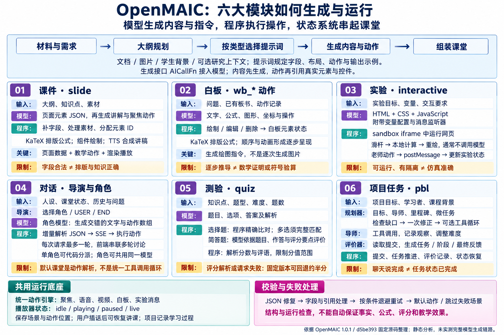

# OpenMAIC 理解汇总：从资料到可执行的课堂

研究日期：2026-09-11。基于 OpenMAIC 1.0.1 / `d5be3933176247feebf4007f6e31e20b93871609`。本文汇总产品判断与固定源码结论；完整来源见[模块原理](06-module-principles.md)和[同类对比](04-comparison.md)。没有完成上游模型生成、教学成效或同题产品评测。

## 一句话理解这个库

**OpenMAIC 是面向课程创作与互动授课的开源平台：输入主题或学习材料，生成课件、讲解、白板、交互实验、测验和项目任务，再由 AI 老师与同学组织为可以播放、提问、操作和继续修改的课堂。** 它适合教师备课、科普小课、企业培训及教育产品开发；最值得研究的是课程如何生成，以及生成结果如何由程序可靠执行。

这是一套围绕教学场景设计的应用和工程组件，不是一个拥有六种独立能力的新基础模型。课程领域之外也可复用其中的结构化页面、动作引擎和角色调度，但业务协议、提示词与状态规则需要相应改造。

## 我们逐步确认的五个认识

1. **主要针对课堂，但课堂不限于学校。** 老师、同学、讲解、测验和项目里程碑是默认设计对象；新人培训、产品教学和项目入门同样可以采用这一流程。
2. **前期处理有共性，不能说底层完全一样。** 文件解析、模型调用、检索与媒体服务可以复用通用技术，但各项目的资料组织、检索策略、上下文和状态规则不同。OpenMAIC 课程生成路径不能直接等同于 NotebookLM 的内部流程。
3. **差异超过展示层。** 为了让页面、语音、白板和角色回答协调运行，需要课程数据协议、内容与动作的分离、播放器状态、导演调度、工具执行和任务评价；这些会反过来约束模型要生成什么。
4. **生成和运行是两件事。** 模型生成文本、结构化数据或网页代码；组件、规则程序和浏览器把它们变成可操作效果。拖动实验滑杆通常是本地计算，不是每拖一次都请求大模型。
5. **六种效果不等于六种独立模型或六类场景。** 源码的主要场景是 slide、quiz、interactive、pbl；白板与角色对话可以跨场景提供。多个角色可共用同一个模型，以人设、上下文和可用动作区分。

## 六种效果究竟怎么来

原创内容、AI 辅助绘制的说明图；详细代码边界以正文为准。[图片来源](../assets/README.md)

| 能力形态 | 模型主要生成什么 | 程序如何实现效果 | 需要核验的地方 |
| :--- | :--- | :--- | :--- |
| 课件与讲解 | 带元素、坐标和样式的页面数据；随后生成引用元素的讲解与高亮动作 | 校验、归一化后交给课件组件；播放器执行动作，语音由 TTS 服务合成 | 页面内容是否准确、布局是否可读、动作是否对应正确元素 |
| 白板 | 文本、公式、图形及相应位置和顺序的绘制动作 | 白板组件、公式排版和动作引擎按指令绘制 | 公式推导是否正确；能绘制不代表系统做了数学证明 |
| 交互实验 | HTML、CSS、JavaScript；可包含参数配置与消息处理 | 隔离 iframe 运行网页；滑杆等触发本地程序，通过消息机制接受老师操作 | 公式、单位、边界、数值精度和生成代码质量；不是内置科学仿真引擎 |
| 多角色对话 | 导演选择下一位角色；角色生成回答及教学动作 | 默认 LangGraph 路径每个请求处理一轮，前端续接；动作引擎呈现结果 | 人设一致性、轮次终止、上下文有效性；角色多不等于独立事实验证 |
| 测验与反馈 | 题目、选项、标准答案与解析；简答评分时再生成分数和评语 | 选择题用规则匹配，简答题调用模型并解析结果 | 评分一致性；解析失败有半分回退，不能直接当正式考试评分 |
| 项目式学习 PBL | 项目计划、角色、任务、里程碑和评价内容 | 规划校验与修复、角色工具调用、任务状态、提交和评价共同驱动 | 目标是否可完成、交付物是否真实合格；需结合人工或规则核验 |

此外还有备课大纲生成、课程编辑、材料与媒体管理、导入导出。Pro 工作台、PPTX 导入和视频导出受开关或额外服务约束；不能将源码里有入口理解为开箱即用。[逐模块输入、协议、执行与失败处理](06-module-principles.md)

## 用一个实际案例理解整体体验

本研究用同一份“欧姆定律与限流电阻”材料串起八个环节：材料与目标 → 三页课件讲解 → 白板推导 → 参数实验 → 角色讨论 → 测验 → 电阻设计任务 → 改课与导出。[进入在线互动课堂](https://yydshly.github.io/0912_codex_project/005-openmaic/case.html) · [体验路线](05-case-study.md) · [运行说明](../web/README.md)

例如把电压设为 6 V、电阻设为 300 Ω，可观察到电流 20 mA；保持电压不变并增大电阻，查看电流和功率变化，再用单位换算题与设计约束检验理解。这个案例把“看内容、跟推导、亲手操作、回答问题、完成任务”连接起来，展示的是课堂的完整形态。

**验证边界：** 三页课件真实使用官方 renderer 0.1.6 与 DSL 0.11.1；公式、实验、评分与项目规则由本案例程序实现；角色对话为预设脚本，讲解语音使用浏览器能力。案例没有调用模型自动生成整堂课，也没有运行完整 OpenMAIC 后端。上游固定源码的 renderer 包版本为 0.1.7，和本次安装的已发布 npm 版本需区分。

## 为什么要和其他产品比较

比较的意义是确定**用哪种成品、选择什么开发底座、集成时由谁承担哪项职责**。仅比较“有没有问答、测验或语音”会掩盖真正差异；下表是基于产品定位和已研究源码的应用判断，不是质量、价格或教学效果排名。

| 需求与典型场景 | 优先考察的产品 / 项目 | 值得关注的核心 | 与 OpenMAIC 的比较意义 |
| :--- | :--- | :--- | :--- |
| 读论文、报告和课程材料，迅速形成有来源的理解与学习成果 | NotebookLM / Gemini Notebook | 成熟的资料学习流程、来源问答与多种学习成果 | 判断是否直接使用产品即可，无需自建课堂；内部实现不能假定与开源项目相同 |
| 自建资料研究工作台，控制模型、数据与处理流程 | Open Notebook | 笔记本、资料、笔记、问答、内容转换与播客 | 选择材料研究底座；研究成果可作为课程输入，但需自行接通 |
| 把分散在不同系统的资料接入并检索，支撑研究与协作 | SurfSense | 连接器、多来源接入、混合检索与证据组织 | 优先解决“材料在哪里、如何找全”，再考虑课程表达 |
| 围绕个人目标持续辅导、练习、复习和记录进度 | DeepTutor | 学习路径、作答、掌握度规则与反馈 | 研究“下一步学什么”；可为课堂补充持续学习机制，但掌握度规则不等于已验证学习诊断 |
| 教师备课、科普演示、企业互动培训、教育产品开发 | OpenMAIC | 课程协议、教学动作、角色调度、实验与项目任务 | 研究“怎样讲成可参与的一堂课”；需要为准确性、评测和组织运营补足验证 |

NotebookLM 已包含测验、学习引导和音频互动，不能简化成“它只能总结”。Google 于 2026-07-16 宣布更名为 Gemini Notebook，具体新增能力的可用性依账户和发布范围而定。各开源项目也存在功能重叠；版本与官方来源统一见[完整比较](04-comparison.md)。

对于同一份欧姆定律材料，可以把选型问题写得更具体：要查清适用条件与出处，关注资料研究；要持续发现学生在单位换算上的错误，关注学习状态；要让学生看推导、调参数并完成限流设计，关注互动课堂。这是三类交付目标，不代表某个产品只会其中一类。

## 对我们最有价值的扩展方向

“研究资料 → 互动课程 → 学习反馈”可以成为本研究仓库的后续路线：把已核对的源码和解释用于生成项目入门课，再用可运行的小任务检查读者是否理解，并保存反馈。当前这些项目没有现成的完整互通，本地案例也没有实现自动集成。

| 优先项 | 要解决的问题 | 需要增加的实现 |
| :--- | :--- | :--- |
| 来源可追溯与教师审核 | 学生或审稿人能定位一句讲解的依据 | 来源片段 → 课程元素 / 动作映射，版本记录和发布前审核 |
| 可信实验与评分 | 生成结果好看但可能算错、判错 | 经测试的学科模板、单位与边界检查、明确评分规则和失败提示 |
| 学习事件与针对性补课 | 一堂课结束后还知道哪里没学会 | 题目 → 知识点映射，作答 / 实验 / 项目事件，复习与补课策略 |
| 企业或学校部署 | 身份、内容权限、进度与运营需要接入 | 用户与课程权限、数据隔离、课程发布、学习系统对接 |
| 成本和生成质量管理 | 长课程的延迟、费用与人工修改量难控制 | 分阶段模型选择、媒体缓存、断点恢复及固定样本回归评估 |

这些是建议，不是上游已完成能力。首先应以一份固定材料运行真实生成，记录模型与配置、耗时、费用、错误、人工修改量和学习任务完成情况，再决定采用哪些模块。

## 完整资料入口

- [项目摘要与能力清单](../README.md) · [能力全景图](../assets/capability-overview.png)
- [技术架构与源码地图](01-architecture.md) · [六模块底层原理及引用代码](06-module-principles.md)
- [效果、应用场景与扩展](02-effects-and-roadmap.md) · [五个同类产品比较与来源](04-comparison.md)
- [欧姆定律案例](05-case-study.md) · [网页运行与发布说明](../web/README.md)
- [研究验证边界](03-validation.md) · [案例与网页验证记录](../web/validation.md) · [素材来源与许可](../assets/README.md)

[返回项目说明](../README.md)
