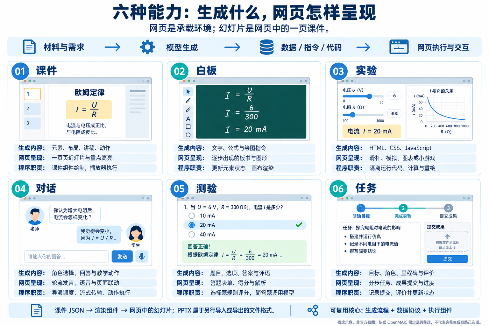

# 六能力引导与研究网页导航

这份导航汇总本研究的能力展示、互动案例、生成实验台与原理文档。研究依据 OpenMAIC 1.0.1 / `d5be3933176247feebf4007f6e31e20b93871609`；示例生成使用本地模板，未运行上游完整模型生成链路。

## 一图理解：内容怎样在网页中呈现



新增原创引导图，使用 imagegen 辅助绘制；用于解释概念，不是官方界面截图。[查看原图](../assets/six-capabilities-web-guide.png) · [素材来源记录](../assets/README.md)

## 幻灯片、网页和数据格式分别是什么

**网页是承载环境，幻灯片是一页教学内容的组织方式。** OpenMAIC 将一页课件保存为符合其 DSL 规范的 JSON，里面记录背景、元素类型、内容、坐标、尺寸与元素 ID。渲染组件读取数据，再在浏览器中绘制这一页；讲解、高亮和翻页由另外的动作与播放器控制。

```text
课件数据 JSON → 课件渲染组件 → 网页里的一页幻灯片
教学动作     → 动作与播放引擎 → 高亮、讲解、翻页等效果
```

因此，JSON 是数据表示，幻灯片是内容形态，网页是运行与呈现环境。PPTX 是另行导入或导出的文件格式；显示一页幻灯片不要求先生成 PPTX。

普通网页常用随窗口宽度调整的内容布局；该库课件则在指定画布中安排元素，再按显示区域缩放。课件渲染是网页的一部分，同一课堂网页还可以容纳白板、实验、对话、测验和任务。

## 六项能力的分工

| 能力 | 模型主要生成什么 | 网页上看到什么 | 程序负责什么 |
| :--- | :--- | :--- | :--- |
| 课件 | 元素、布局、讲稿与动作 | 一页页幻灯片，配合高亮与讲解 | 组件绘制元素，播放器执行动作 |
| 白板 | 文字、公式及元素操作指令 | 逐步出现的板书、公式和图形 | 更新白板元素状态并渲染 |
| 实验 | HTML、CSS、JavaScript | 滑杆、模拟、图表、代码练习或小游戏 | 隔离运行网页，响应事件、计算与重绘 |
| 对话 | 角色选择、回答和配套教学动作 | 轮流发言，文字、语音与页面操作联动 | 导演调度、上下文构造、流式传输及执行 |
| 测验 | 题干、选项、答案与评价 | 答题表单、分数、解析与重试 | 选择题按规则判分，简答题调用模型并保存结果 |
| 任务 | 项目目标、角色、里程碑和评价 | 分步任务、导师辅导、成果提交与进度 | 保存提交，处理评价并维护任务状态 |

表格概括上游机制。生成实验台的白板、对话、测验和任务采用简化实现，并在模块内明确标注。[六模块源码与边界](06-module-principles.md)

## 先看哪一页

推荐按“建立概念 → 观察完整体验 → 拆开运行过程 → 查源码与选型”阅读。下表路径以站点的 `005-openmaic/` 为起点；既有在线站点根地址为 [OpenMAIC 研究站](https://yydshly.github.io/0912_codex_project/005-openmaic/)。

| 顺序 | 网页 | 用来理解什么 |
| :--- | :--- | :--- |
| 1 | 本页 `docs/web-guide.html` | 用引导图区分生成内容、网页呈现和执行职责；汇总全部入口 |
| 2 | [能力总览](https://yydshly.github.io/0912_codex_project/005-openmaic/) `index.html` | 官方示例、六类能力、技术概览与应用定位 |
| 3 | [欧姆定律互动课堂](https://yydshly.github.io/0912_codex_project/005-openmaic/case.html) `case.html` | 沿八个教学环节体验一堂课的整体形态 |
| 4 | [生成与执行实验台](https://yydshly.github.io/0912_codex_project/005-openmaic/generation.html) `generation.html` | 改输入、编辑 JSON 或代码、执行动作、观察效果，下载产物与提取说明 |
| 5 | [六模块底层原理](06-module-principles.md) `docs/module-principles.html` | 追踪提示词、生成协议、解析、组件、状态和失败处理 |
| 6 | [理解汇总](07-understanding.md) `docs/understanding.html` | 能力、工程特点、对比意义、场景和扩展路线 |
| 7 | [五产品对比](04-comparison.md) `docs/comparison.html` | 区分资料研究、多源检索、持续辅导和互动授课的选型需求 |

其余参考网页都从版本管理中的 Markdown 构建，避免网页和文档分别维护两套正文：

| 参考网页 | 内容 |
| :--- | :--- |
| [项目说明](../README.md) `docs/research.html` | 库的摘要、能力清单、版本、场景与研究边界 |
| [笔记索引](README.md) `docs/notes.html` | 各专题研究的有序目录 |
| [架构地图](01-architecture.md) `docs/architecture.html` | 生成、数据协议、调度、执行与存储 |
| [效果与扩展](02-effects-and-roadmap.md) `docs/roadmap.html` | 应用场景、扩展建议和实现条件 |
| [研究验证](03-validation.md) `docs/validation.html` | 固定源码证据、初次检查及未完成实测 |
| [案例说明](05-case-study.md) `docs/case-study.html` | 八环节体验路线、组件与案例实现的对应关系 |
| [素材与许可](../assets/README.md) `docs/assets.html` | 原创图、官方素材来源及许可 |
| [网页运行说明](../web/README.md) `docs/web.html` | 依赖、构建、入口及实验台的具体实现边界 |
| [网页验证](../web/validation.md) `docs/web-validation.html` | 自动检查、构建、部署核验及浏览器测试边界 |

合计：3 个应用页面 + 13 份参考页面。本导航和新增引导图在本次改动中加入；本批改动已获用户确认，与既有网站统一构建和发布。

## 怎样从实验台提取能力

对每个模块分别保存三类东西：**生成流程、数据协议、执行组件**。实验台可以下载示例产物和提取清单；清单列出应保留的接口、组件与状态，并链接固定上游源码。

课件尤其依赖数据格式与渲染组件配套；实验直接依赖浏览器代码与消息协议；对话、测验和任务还需接通上下文、作答、提交及状态管理。迁移到其他网页可以继续使用这些组件；迁移到原生应用则需要嵌入网页，或重新实现呈现和交互层。

[返回项目说明](../README.md)
