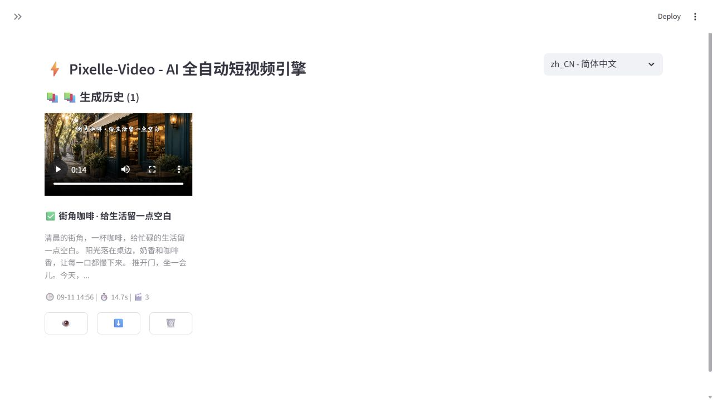

# 006 · Pixelle-Video

把文案、配音、图片或视频，按分镜模板组织成短视频。此次已运行真实源码，并产出可播放成片。

| 项目 | 内容 |
| :--- | :--- |
| 原始仓库 | [ATH-MaaS/Pixelle-Video](https://github.com/ATH-MaaS/Pixelle-Video) |
| 作者 / 许可 | AIDC-AI / Apache-2.0，以上游 LICENSE 为准 |
| 研究版本 | 0.2.0 / `848b054e4fae40dabc62ec58e960b573e83793ac` |
| 研究日期 / 状态 | 2026-09-11 / 研究中 |
| 技术栈 | Python、Streamlit、HTML 模板、Playwright、FFmpeg、Edge TTS、ComfyUI/模型 API |
| 演示状态 | 本地真实应用已运行；已合成 14.7 秒 1080p 视频；未部署公网 |

## 先看真实效果

[播放 / 下载本次成片](assets/cafe-demo.mp4) · [本机原版应用](http://127.0.0.1:8506/History) · [复现说明](web/README.md)

**这张图是成片画面，不是产品界面模拟。** 两张图片由本次 Codex 内置 imagegen 实际生成，三段文案由 Codex 编写；Pixelle 原生服务实际完成 Edge TTS 配音、HTML 模板渲染、按语音时长生成片段、拼接 MP4 和历史记录持久化。此例属于静态图片配音短片，没有验证 AI 动态镜头生成。

## 核心能力与原理

1. 文本进入故事板：AI 编写或处理脚本，形成标题、分镜旁白与画面提示词；也能输入自写文本。
2. 给分镜准备素材：可连接 ComfyUI、RunningHub 或直接媒体 API；当前界面另有自定义素材、数字人口播、图生视频、动作迁移入口。
3. 配音决定片段时长，HTML 模板决定最终画幅、文字和素材位置。
4. Playwright 渲染模板，FFmpeg 合成视频、拼接片段并加入背景音乐，任务写入历史。

核心更接近一个有预设制作流程的短视频引擎。底层模型可以替换，但替换模型不等于自动改变故事板结构、模板规则或生产流程。

## 本次实测与边界

| 环节 | 本次情况 |
| :--- | :--- |
| 原版 Web 页面 / 历史页 | 已启动、打开并播放成片 |
| 文案 / 图片 | 当前 Codex 生成后交给应用；没有冒充应用内 API 返回 |
| Edge TTS | 已实际联网生成，声音 zh-CN-XiaoxiaoNeural |
| 原生渲染与合成 | 3 段，1920×1080，H.264 + AAC，成片 14.718667 秒 |
| 应用内 LLM / 图像模型调用 | 未配置、未验证 |
| AI 动态视频 / 数字人 / 动作迁移 | 仅核对功能入口，未实测 |
| 完整“输入一句话→应用自行生成全部素材” | 本次未验证；使用原生服务层接收 Codex 素材 |

适合图文解说、知识口播、图文推广、模板化内容批量生产。可扩展方向包括新模板、垂直领域脚本策略、模型适配器、更多素材检索渠道、人工审阅与发布流程。这些方向是源码分析后的建议，不是本次已实现能力。

[与 waoowaoo 的差异](../007-waoowaoo/notes/comparison.md) · [实验记录](notes/README.md) · [素材来源](assets/README.md) · [返回总索引](../../README.md)
