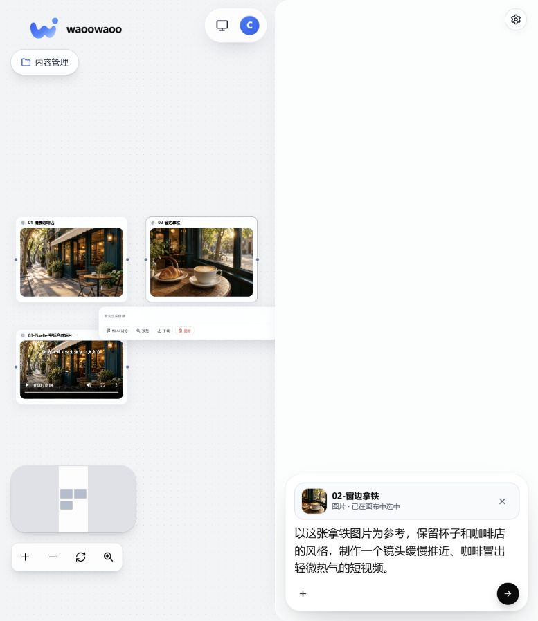

# 007 · waoowaoo

一个围绕 Assistant、素材资源和画布组织创作的图像 / 视频工作区。本次安装的是 **v0.5.0-beta.1**；不要直接用早期“小说转漫剧”演示概括这个版本。

| 项目 | 内容 |
| :--- | :--- |
| 原始仓库 | [waooAI/waoowaoo](https://github.com/waooAI/waoowaoo) |
| 作者 / 许可 | waooAI / Elastic License 2.0，以上游 LICENSE 为准 |
| 研究版本 | v0.5.0-beta.1 / `6cbbe22cc6492159e0f649d507e4e21a9aec3074` |
| 研究日期 / 状态 | 2026-09-11 / 研究中 |
| 技术栈 | Next.js、React、Prisma / MySQL、Temporal、Redis、MinIO、独立 Codex runtime |
| 演示状态 | 已实际登录并验证画布、图片预览、素材引用；应用内模型生成未验证 |
| 本地入口 | <https://localhost:1443>（本机已获授权信任证书并正常访问；不是公网演示） |

## 已经准备好的真实案例

项目名：**街角咖啡 · Codex 实际素材演示**。项目中已通过原生登录、建项目、上传和资源登记接口保存：

1. Codex 内置 imagegen 生成的咖啡店外景。
2. Codex 内置 imagegen 生成的拿铁近景。
3. Pixelle 实际合成的 14.7 秒短片。

已从应用重新读取这三项素材，并逐项核对 SHA-256。详见[验证记录](notes/import-verification.json)。图片与视频均真实存在于本机私有 MinIO；未用占位图或假接口。

此图是**本机原版应用截图**。已实际打开图片预览，并通过“和 AI 讨论”把拿铁图片引用到助手。右侧需求草稿尚未提交；画布中的视频来自 Pixelle，不是 waoowaoo 自己生成的动态视频。[图片预览截图](assets/image-preview.jpg)

## 核心能力

上游此版本说明的是：右侧 Assistant 帮助形成创作意图；用户上传参考素材；画布组织和检查图片、视频；按具体模型支持的比例、时长、分辨率、首帧 / 首尾帧 / 参考图生成；已有结果可继续加工为新版本。

本次实际验证了“认证→建项目→上传→登记资源→读取媒体→画布→图片预览→引用到助手”，没有调用应用内 Assistant 或图像 / 视频模型。界面中的生成配置目前面向 OpenRouter；当前 Codex 会话内置图片工具没有自动变成该应用的模型服务。

## 与 Pixelle 的直观差别

**Pixelle 的演示成果是一条按模板制作好的短片；waoowaoo 的演示准备成果是一个包含可复用素材的创作项目。**

二者可复用相近的模型服务，但内部长期保存的对象、流程调度、编辑方式和用户控制点不同，因此不能把差异全部理解成上层界面的细微变化。

[四项目理解汇总网页](web/summary/README.md) · [四项目理解笔记](notes/four-projects.md) · [两项目实测对比](notes/comparison.md) · [运行说明](web/README.md) · [实测边界](notes/README.md) · [素材来源](assets/README.md)

## 适用与扩展方向

适合需要参考图、多次尝试、素材组织、画面迭代和项目连续创作的工作。基于源码的扩展建议包括行业资源模板、更多模型适配、审核与协作、素材检索、下游剪辑 / 配音工具集成。

本预览 README 明确说明音乐和配音控件尚未包含；不能因为同属视频工具，就把 Pixelle 已实测的配音合成能力直接视为 waoowaoo 此版本同样具备。

[返回总索引](../../README.md)
