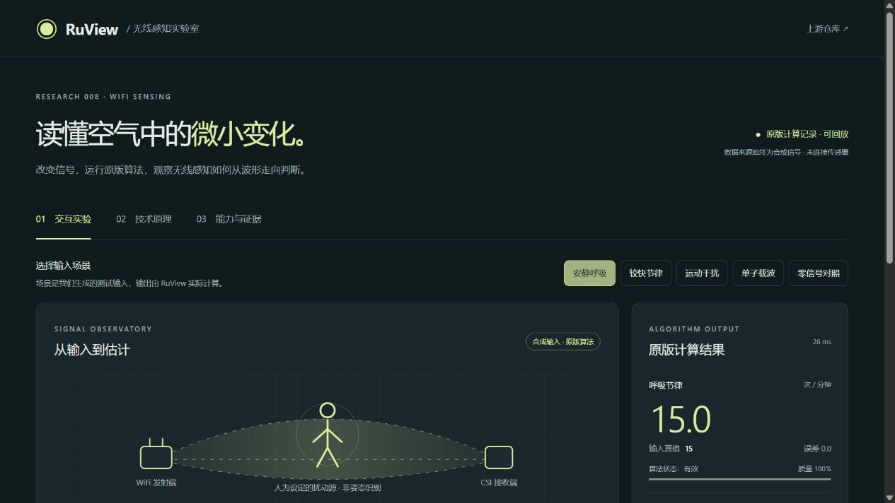
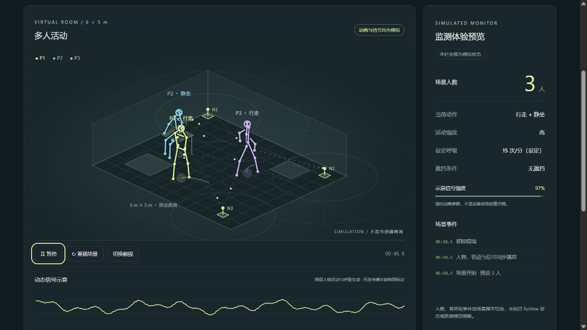

# 008 · RuView

**原理：人体改变 Wi-Fi 的传播路径，多条直达、反射等路径先在接收端叠加。CSI 记录各子载波的幅度和相位，算法再根据这些信息随时间的变化推断活动；复杂姿态还需要训练模型。** “回声”只是理解电磁波反射的类比，不表示设备先识别每条反射波的位置，再拼出人体。

**真实演示依赖：能导出 CSI 的设备与匹配固件、稳定的无线链路和采样、接收服务、目标任务对应的算法或模型，以及现场标定与动作对照。** 只安装软件或打开动画页面不满足这些条件。本机只接入 AX211 的粗粒度 RSSI，运行归档 v1 分类器；用户走动但读数不变的问题仍未证明解决，尚无有效人体检测、定位或体征实测结果。

**对我们的意义：掌握“信号采集 → 状态推断 → 事件 → 产品联动”的开发方法，并建立证据边界。** 无新增专用硬件的方向可从日常蓝牙设备的出现、远近趋势、连接状态，以及手机运动传感器切入；这些需要独立适配与验证，不是 RuView 已有的人体识别结果。

[在线研究汇总](https://yydshly.github.io/0912_codex_project/008-ruview/) · [完整理解笔记](notes/understanding.md) · [网页运行说明](web/README.md#研究汇总网页) · [真实测试所需条件](real-wifi/README.md) · [实测失败线索](notes/live-input-diagnosis.md)

## 基本信息

| 项目 | 内容 |
| :--- | :--- |
| 原始仓库 / 作者 | [ruvnet/RuView](https://github.com/ruvnet/RuView) / ruvnet |
| 研究提交 | [33a9e90896a691a3f98de042b463e5945178b87c](https://github.com/ruvnet/RuView/tree/33a9e90896a691a3f98de042b463e5945178b87c) |
| 研究日期 | 2026-09-13 |
| 研究状态 | 理解已总结；本机 RSSI 链路已验证，人体感知效果与 CSI 硬件待验证 |
| 实际执行模块 | 真实 RSSI：v1 RssiFeatureExtractor、PresenceClassifier；合成实验：wifi-densepose-vitals 0.3.2 的预处理、呼吸与心率提取 |
| 技术栈 | 原版 Rust 模块 + Rust 适配器；RSSI 路径使用 Python / NumPy / SciPy；本地 HTTP 服务与 HTML / CSS / JavaScript |
| 上游许可 | 仓库及所用模块 MIT；独立 MM-Fi 姿态权重 CC BY-NC 4.0，本演示未使用 |
| 演示状态 | 研究汇总网页已发布并核验；真实采集与算法实验在本机运行，AX211 可读 RSSI；ESP32 CSI 硬件未连接 |

## 演示证据分层

| 内容 | 已完成什么 | 不能据此声称什么 |
| :--- | :--- | :--- |
| 原理图与两路波教学模拟 | 帮助理解路径、叠加、幅度与相位；教学模拟曾在对话中展示，未作为本项目独立页面发布 | 不是对当前房间的测量或完整电磁仿真 |
| 虚拟房间 | 脚本控制人物、骨架、轨迹、人数和事件 | 动画不证明算法识别成功 |
| 原版 Rust 算法实验 | 合成输入真实经过原版预处理和周期提取 | 合成信号结果不代表真实呼吸、心率准确率 |
| 本机 RSSI 实测 | 真实读取、原版 v1 特征与分类、历史回放和失败排查 | 信号阶跃触发候选不证明有人走动；无 CSI 或人体定位结果 |
| CSI 人体实测 | 尚未开展，已整理接入与验收步骤 | 不宣称已经实现真实骨架、人数、跌倒或生命体征检测 |

## 真实环境测试

先用这台电脑的 Intel AX211 网卡测试真实信号变化。已提供独立启动脚本，记录 RSSI、时间戳和 RuView 原版分类；读取失败即停止，不使用默认信号或模拟回退。24 秒实测共采集 48 个样本，均为 −56 dBm，分类为未检出变化；无人员动作真值，仅验证采集与计算链路。

[打开真实测试步骤、启动入口与 CSI 硬件接入说明](real-wifi/README.md)。现有网卡路径只验证粗粒度信号变化及活动候选，不能验证骨架、人数、心跳或可靠的呼吸检测。

随后已完成 [3 分钟真实现场观察](notes/live-wifi-test-20260913.md)：356 个样本，约第 62 秒 RSSI 从 −56 变为 −62 dBm，触发连续 4 次活动候选，之后恢复。用户未配合受控动作，不能归因于人体或计算准确率。

后续用户报告走动但无响应。[排查记录](notes/live-input-diagnosis.md)确认当时页面处于历史回放，同时实时 RSSI 也长时间固定；Windows 原生接口对照仍返回相同数值。已加强模式、采集结束和恒定输入提示；尚未验证有效的人体活动响应。

## 演示入口

先看[在线研究汇总](https://yydshly.github.io/0912_codex_project/008-ruview/)，关联原理、依赖、价值、实测记录与实验启动说明。已于 2026-09-13 发布并实际核验；[本机汇总入口](http://127.0.0.1:8770/summary.html)可直接跳转到以下实验。发布与运行说明见[网页说明](web/README.md#研究汇总网页)。

以下实验地址仅供启动服务后的本机使用，不是公开演示地址；历史原始记录不随仓库分发，其他电脑会显示该回放不可用。

- [打开真实 WiFi 监测页面](http://127.0.0.1:8770/live.html)：本机网卡实时曲线、原版活动分类、停止与重新采集，以及已校验的现场实测回放。
- [打开虚拟房间演示](http://127.0.0.1:8768/scene.html)：走动、静坐呼吸、跌倒、多人、空房动态场景。
- [打开原版算法实验室](http://127.0.0.1:8768/)：合成输入与原版输出对照。
- [启动与复现说明](web/README.md)。
- [源码与实测记录](notes/README.md) · [机器可读实验结果](notes/experiment-results.json)。

算法实验室页面包含五组实验、波形与子载波残差热图、输入真值与原版结果对照、时间回放、参数重算、JSON 导出，以及技术原理和能力证据页。

图片为本项目页面截图；人体图案是原理示意，非姿态识别输出。来源见 [assets](assets/README.md)。

## 虚拟房间演示

模拟人物骨架、移动轨迹、WiFi 波纹、动态信号、人数与事件面板。支持暂停重播、斜视与俯视、呼吸频率、速度、干扰和隔墙控制。全部动作、人数和事件来自场景脚本，不是 RuView 识别结果，也不是经过物理标定的无线信道仿真。

下方可单独把节律与干扰参数送入原版算法计算；不把动画骨架当作推理结果。

## 本次验证结果

| 场景 | 输入呼吸 / 心跳（次/分） | 原版呼吸 / 心率输出 | 观察 |
| :--- | :--- | :--- | :--- |
| 安静呼吸 | 15 / 72 | 15.0 / 73.17 | 理想周期输入能够提取 |
| 较快节律 | 24 / 96 | 24.0 / 103.45 | 心率有明显偏差，状态降级 |
| 运动干扰 | 15 / 72 | 无结果 / 49.18 | 锁定错误周期；心率内部状态仍是 Valid |
| 单子载波 | 15 / 72 | 15.0 / 73.17 | 心率质量约 0.159，状态 Unreliable |
| 零信号对照 | 无周期输入 | 无结果 / 无结果 | 未用默认值伪造读数 |

以上是确定性合成信号测试，不是人体实测准确率。每组 45 秒、50 Hz，默认 56 个子载波；单子载波组为 1 个。运行耗时随机器变化。

## 能力边界与后续

本次实际运行两条独立路径：真实 RSSI 经归档 v1 特征提取与活动分类；合成信号经原版 Rust 预处理、呼吸与心率提取。没有运行人数、跌倒或姿态模型，也未连接 ESP32。图案代表人为设置的输入，不是人体定位结果。预置数据来自合成输入的真实计算记录，参数实验需要本地服务。

若继续验证 RuView 人体能力，应先接入 CSI 设备、验证真实采集与时间戳、同步动作或参考设备并报告误差与覆盖率。公开 MM-Fi 高分不能外推到任意房间或当前 ESP32 模型。

若优先复用日常设备，则另行验证“电脑＋手机”的蓝牙设备感知或手机动作遥控，再考虑事件联动。当前没有实现蓝牙采集、手机应用或家居控制。价值与实施顺序见[理解汇总](notes/understanding.md)。

## 复现与许可

依赖、源码锁定信息与运行说明均在 [web](web/README.md)。原版源码缓存和编译产物被忽略，不提交第三方仓库副本。研究汇总使用独立静态构建接入 Pages 清单；真实采集和 Rust 计算保留在本机服务中。

[返回总索引](../../README.md)
