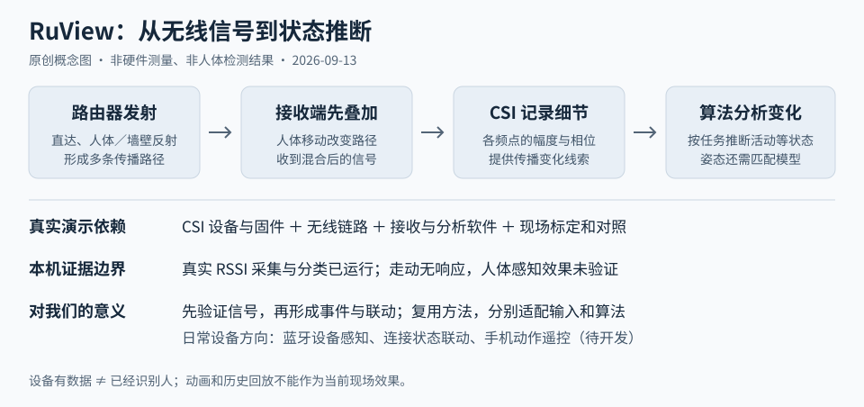

# RuView 理解汇总：原理、真实演示依赖与对我们的意义

整理日期：2026-09-13。研究上游固定提交：[33a9e90896a691a3f98de042b463e5945178b87c](https://github.com/ruvnet/RuView/tree/33a9e90896a691a3f98de042b463e5945178b87c)。状态：理解已总结；本机 RSSI 采集与算法链路已验证，人体感知效果和 CSI 硬件未验证。本文区分本地实测、上游报告与后续设想。

对应的[网页汇总与访问说明](../web/README.md#研究汇总网页)提供按原理、依赖、证据、价值与体验入口组织的阅读页面；三个本地实验页面均可进入该汇总。

## 摘要

**原理**：人体会改变 Wi-Fi 的直达、反射等传播路径。多路信号先在接收端叠加，芯片从已知训练信号估计各子载波的信道响应，导出的幅度与相位等信息就是 CSI。软件分析其随时间的变化，尝试推断活动、位置或姿态；这些任务并不都要求先给每条反射波定位。

**真实演示依赖**：能输出 CSI 的硬件和固件、可用的无线链路和采样、接收程序、匹配任务的算法或模型，以及现场布置、标定和同步对照。单个 ESP32 节点可以作为采集起点，不保证人数、定位、呼吸或姿态效果。普通网卡可读 RSSI 与完整 CSI 感知不是同一能力。

**对我们的意义**：学习从可观测信号推断状态，再把状态变成事件和产品联动；首先验证输入是否足够、结果是否与现实对应。日常设备可以从蓝牙随身设备感知、连接状态自动化、手机动作遥控切入。这些方向复用方法与软件组织方式，需要各自适配传感器和算法，不能直接继承 RuView 的人体感知能力。



## 1. 核心理解：先叠加，再分析

```text
路由器发送 Wi-Fi 数据包
  → 直达路径 + 人体、墙壁等产生的反射及其他传播路径
  → 多条路径在接收天线处叠加
  → 芯片估计信道，导出 CSI
  → 分析多个频点、天线和时刻的信息
  → 按具体算法推断活动、位置或姿态
```

“回声”可以帮助理解反射，但这里是电磁波，不是声波。设备收到的通常是混合信号，没有天然附带“这条来自人体、那条来自墙壁”的标签。

人体移动会改变路径长度、遮挡和反射条件。不同路径的波峰可能对齐，也可能错开或抵消，所以接收信号的幅度、相位会变化。CSI 芯片利用数据包中已知的训练字段估计各子载波的响应；芯片本来就需要信道估计来通信，CSI 采集的关键是把这些细节提供给外部程序。[Espressif 驱动说明](https://docs.espressif.com/projects/esp-idf/en/v5.0/esp32s3/api-guides/wifi.html#wi-fi-channel-state-information)

粗粒度活动检测可以分析波动、频段能量等特征，不必先算坐标。复杂姿态可以由模型从一段 CSI 直接预测人体关键点。例如上游 MM-Fi 研究使用多天线、多子载波、多个时间帧的 CSI 幅度输入姿态模型，并不是逐条回波测距后拼出人体。该研究还报告明显的跨环境性能下降；本项目仅核对其报告，未复现训练。[上游 MM-Fi 研究](https://github.com/ruvnet/RuView/blob/33a9e90896a691a3f98de042b463e5945178b87c/docs/benchmarks/mmfi-wifi-sensing-study.md)

## 2. RSSI、CSI 与人体结论的区别

| 层次 | 得到的信息 | 能说明什么 |
| :--- | :--- | :--- |
| RSSI | 总体接收强度，常以 dBm 表示 | 可以观察粗粒度变化；受量化、平滑、更新机制和环境影响 |
| CSI | 多个频点、天线链路上的复数信道响应，可表示为幅度和相位 | 提供更细的传播变化线索；不能直接等同于人体坐标 |
| 特征与模型 | 对信号统计、周期或模式的分析 | 给出任务相关的活动候选、周期或姿态估计 |
| 现场验证 | 将输出与同步标注的真实事件或参考设备比较 | 才能评价检测、定位或测量是否有效 |

总强度变化很小时，频点间的分布或相位仍可能变化。不过 CSI 也包含噪声和硬件误差，不能把所有变化都归因于人体。对话中的两路波教学模型只说明叠加与信息损失，未模拟完整房间、硬件误差和人体散射，也不能解释本机读数固定的唯一原因。

## 3. 怎样才算真实演示

| 目标 | 所需条件 | 验收方式 |
| :--- | :--- | :--- |
| 普通网卡信号曲线 | 系统能读取原始 RSSI；本项目使用 Windows AX211 | 来源、时间戳、原始读数可追溯；失败时停止，不补造波动 |
| CSI 采集曲线 | 受支持的芯片与导出固件、无线数据包、接收与解析程序 | 节点、包数、时间戳、子载波数据与质量可核对 |
| 人体活动检测 | 上述输入，加上合适的布置、算法和环境参数 | 多轮静止、走动、空房对照，记录误报、漏报与延迟 |
| 位置、人数、姿态 | 任务所需空间信息、匹配的天线／节点布局和模型；必要的训练或标定 | 与同步位置、人数或关键点真值比较，验证换人、换位置与换房间 |
| 呼吸等周期测量 | 足够的信号质量、适用的静止条件与提取算法 | 与同步人工计数或参考设备比较，报告误差和无效时段 |

CSI 采集起步可使用受固件支持的 ESP32-S3 开发板、USB 数据线、2.4 GHz 路由器和电脑。还需匹配板型、固件、通信协议与服务端输入模式。单节点采集成功只完成了输入环节；是否足够完成目标任务，要通过后续对照决定。[Espressif CSI 项目](https://github.com/espressif/esp-csi) · [固定版本 RuView 固件说明](https://github.com/ruvnet/RuView/blob/33a9e90896a691a3f98de042b463e5945178b87c/firmware/esp32-csi-node/README.md)

本机尚未执行 CSI 硬件流程。详细步骤及未验证范围见[真实 Wi-Fi 测试说明](../real-wifi/README.md)。本项目 8770 页面只显示 RSSI；8768 的人物骨架、轨迹和人数由场景脚本生成。两者都不能作为真实 CSI 人体识别结果。

## 4. 本次实际完成什么，未证明什么

| 工作 | 观察与结论 |
| :--- | :--- |
| 原版 Rust 模块运行 | 合成输入经过真实的预处理、呼吸和心率提取；运动干扰时出现错误心率，内部 Valid 状态不代表准确 |
| 24 秒真实 RSSI 链路检查 | 48 个样本均为 −56 dBm；只验证采集与计算，没有人体动作真值 |
| 3 分钟真实观察 | 356 个样本；约 62 秒由 −56 变为 −62 dBm，4 个重叠分类窗口输出活动候选；当时没有受控动作，不能归因于人体 |
| 用户走动但画面无变化 | 页面曾处于历史回放；同时实时记录 355 个样本均为 −57 dBm，原生 Windows 查询也固定。未证明有效的人体活动响应 |
| 页面修正 | 明示历史、实时、采集结束、连续相同输入；修正信息呈现，未声称提升人体检测准确率 |
| CSI、蓝牙与家居联动 | CSI 硬件未连接；蓝牙采集、手机应用和家居联动尚未实现 |

读数固定可能与驱动更新、量化或几何布置等有关，本次未区分各因素。查询时间更新只证明程序重新读取，不证明传感器产生了新的独立物理样本。用户走动反馈是失败线索；没有同步动作时段，无法计算漏检率。

[合成实验与证据](README.md) · [三分钟实测记录](live-wifi-test-20260913.md) · [走动无响应排查](live-input-diagnosis.md)

## 5. 对我们的价值与意义

### 5.1 认识新的输入来源

AI 或规则系统的输入不必只有文字、图片，也可以是无线信号、连接状态、手机加速度和声音。这些信息描述的是不同对象：无线传播变化、某台设备是否可见、手机本身是否旋转，不能混为“已经看见人”。

### 5.2 把感知组织成可验证的产品链路

可复用的组织方式是：

```text
设备适配 → 原始数据与采集质量 → 去噪／特征 → 状态与未知状态
        → 带时间和来源的事件 → 提醒、界面或设备联动
```

本项目已实践来源锁定、原始值保留、实时与历史区分、采集异常停止和失败案例记录。BLE 或手机传感器项目可以借鉴这些做法；输入协议、特征和算法则需要重新适配。事件可以先输出“设备暂时失联”或“信号变化候选”，不急于升级为“人已离开”或“有人跌倒”。

### 5.3 用失败结果决定是否值得继续

“网页有曲线”“动画很像”“模型给了高分”都不足以证明现实效果。本次 RSSI 无响应的价值，是暴露当前输入与目标之间的差距，避免继续包装未经验证的人体功能。下一阶段应按目标选择：研究无线人体感知时补足 CSI 条件；优先复用现有设备时改做有明确观测对象的功能。

## 6. 不增加专用设备，可以扩展什么

以下是根据现成设备能力提出的开发方向，不是本项目已交付功能。

| 日常设备 | 可观测信息 | 可扩展产品 | 边界与前提 |
| :--- | :--- | :--- | :--- |
| 电脑＋随身手机蓝牙 | 配对／连接状态，接口允许时的信号强度 | 离席提示、离席锁屏、设备在场时间线 | 感知的是手机；人走开但手机留下会误判 |
| 电脑＋持续发送 BLE 广播的手机 | 可识别广播、时间戳、RSSI 趋势 | 设备出现／消失、粗略远近趋势 | 需广播与扫描权限及硬件支持；不能将 RSSI 当作精确米数 |
| 手机／电脑＋耳机 | 可获取的连接与音频状态 | 连接后打开会议工具、断连提醒或暂停播放 | 连接不等于佩戴，断连也可能由关机、没电造成 |
| 手机＋家庭 Wi-Fi | 应用或路由器可提供的网络连接状态 | 到家情景、设备在线提醒 | 系统后台更新可能延迟；网络连接不证明人体位置 |
| 手机运动传感器＋电脑 | 加速度、角速度、姿态等可用数据 | 倾斜控制、旋转演示、摇动翻页 | 传感器测量手机动作，蓝牙／Wi-Fi 只是传输通道；需适配应用 |
| 电脑扬声器＋麦克风 | 已知声音及接收频谱的变化 | 近距离声学手势实验 | 研究方向；频响、回声消除和噪声处理影响可行性，未在本机验证 |

现成证据与参考：

- Windows 动态锁使用配对手机的蓝牙 RSSI 判断远离并锁定电脑，说明日常硬件已能支撑此类功能；它并非人体定位。[微软说明](https://learn.microsoft.com/en-us/windows/security/identity-protection/hello-for-business/hello-feature-dynamic-lock)
- Home Assistant 安卓应用提供 BLE Transmitter，可作为手机广播的实现参考，仍需确认设备兼容性与系统后台限制。[应用传感器文档](https://companion.home-assistant.io/docs/core/sensors/) · [Android 蓝牙权限](https://developer.android.com/develop/connectivity/bluetooth/bt-permissions)
- 蓝牙地址可能轮换，持续识别需使用自己设备的受控标识或适配机制，不能假设每台耳机／手机一直广播固定地址。[Home Assistant 私有 BLE 设备说明](https://www.home-assistant.io/integrations/private_ble_device)
- 普通蓝牙 RSSI 是粗粒度距离线索。更精细的 Channel Sounding 使用相位和往返时间，需要通信双方支持对应功能；不能默认旧硬件升级软件即可获得。[Bluetooth SIG 说明](https://www.bluetooth.com/learn-about-bluetooth/feature-enhancements/channel-sounding/)
- 手机加速度计和陀螺仪可用于倾斜、摇动与旋转交互，具体传感器可用性因设备而异。[Android 运动传感器](https://developer.android.com/develop/sensors-and-location/sensors/sensors_motion)
- 微软 SoundWave 展示了用普通设备的扬声器与麦克风分析多普勒变化的手势研究，不能据此保证当前电脑可用。[研究项目](https://www.microsoft.com/en-us/research/project/soundwave-using-the-doppler-effect-to-sense-gestures/)

将原来的固定 Wi-Fi 链路换成蓝牙 RSSI，并不会自动获得无接触人体识别。蓝牙随身设备方案的差异在于：发射设备跟着人移动，观测目标变成那台设备本身。

## 7. 专用设备方向的类比与取舍

| 技术／产品 | 类比关系 | 适合的目标 |
| :--- | :--- | :--- |
| [Origin Wi-Fi Sensing](https://www.originwirelessai.com/wifi-sensing/) | 与 RuView 同类，分析多径 CSI 变化；需支持的芯片／固件集成 | 家庭活动、占用状态和自动化；厂商资料不代表本机验证 |
| [Aqara FP2 毫米波传感器](https://www.aqara.com/us/product/presence-sensor-fp2) | 用专用电磁波传感器分析人体反射 | 区域存在与联动；需要设备和正确安装 |
| [TI 超声波泊车方案](https://www.ti.com/tool/TIDA-01597) | 发声并根据回波测距，更接近“回声定位” | 障碍物距离，需要超声波收发器 |
| [AirTag 近距离精确查找](https://www.apple.com/newsroom/2021/04/apple-introduces-airtag/) | UWB 设备间定位，需要标签配合，不是无标签人体感知 | 寻找带标签物品；此来源是初代产品介绍，不用于判断当前型号参数 |
| [ST 机器振动异常检测](https://www.st.com/content/st_com/en/st-edge-ai-suite/case-studies/anomaly-detection-in-an-engine-running-at-different-speeds.html) | 不依赖回声，但同样从信号模式推断状态 | 电机状态与异常检测，需要合适传感器与数据 |

跨到毫米波、超声波或振动监测时，需要更换或适配输入硬件与算法。可复用的是记录、分析、事件与验证框架，不能只替换页面就得到这些产品能力。

## 8. 后续优先级与验收标准

当前优先复用日常设备，建议选择一个小目标：

1. **先确认输入**：设备是否真正广播、系统是否能读到数据、更新频率和稳定标识是否足够；不支持就明确报告。
2. **做真实反馈**：蓝牙来源、RSSI 与出现／失联时间线，或手机动作与电脑画面同步；缺失输入显示未知，不播放预设变化。
3. **做重复对照**：手机近／远、携带／留桌、停止广播／实际离开分别记录；统计错误事件和延迟。
4. **再接一个联动**：先做页面提示或本地提醒，确认可靠后再接锁屏、音频或家居控制。

若重新选择 CSI 人体研究，则按第 3 节补齐条件，先验证固定房间的静止、走动、空房对照，再谈人数、姿态或生命体征。两个方向分别验收，不能借一个方向的成功替另一个背书。

[返回项目](../README.md) · [返回总索引](../../../README.md)
